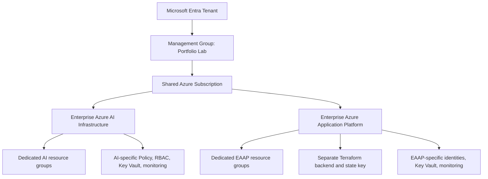
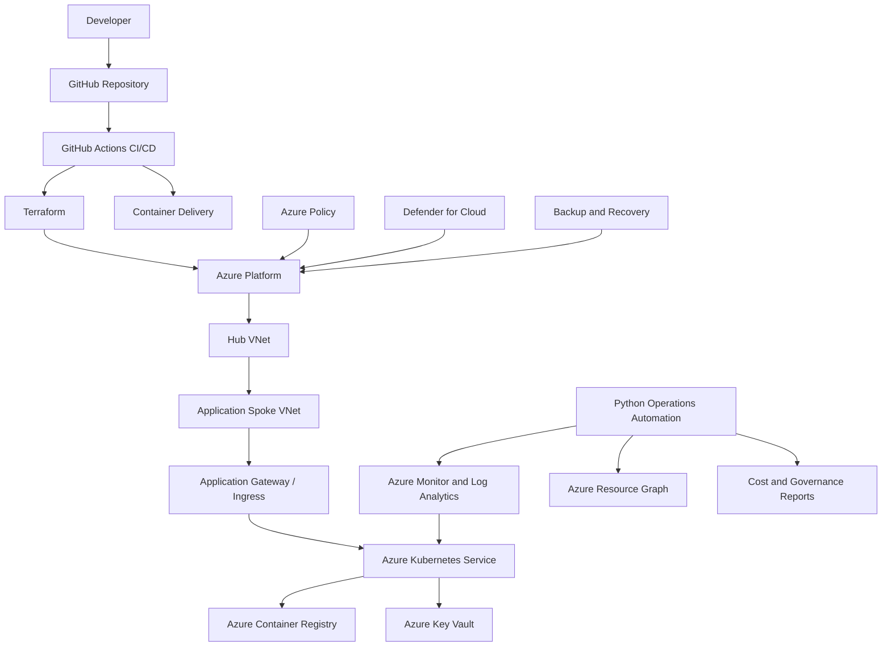

<div align="center">

# Enterprise Azure Application Platform
### Production-Style Platform Engineering with Terraform, AKS, CI/CD, Python Automation, Security, and Observability

**Microsoft Azure | Terraform | Python | Kubernetes | GitHub Actions | Azure Monitor**

</div>

---

## Overview

The **Enterprise Azure Application Platform** is a production-style Azure environment designed to host modern containerized applications securely, reliably, and repeatably.

The project demonstrates how an Azure cloud engineering team can establish a governed landing zone, deploy enterprise networking, manage identities and secrets, operate an Azure Kubernetes Service platform, automate infrastructure delivery, monitor platform health, and recover from failure.

Terraform is used to provision Azure infrastructure. GitHub Actions will be introduced in Workstream 5 to automate infrastructure and application delivery. Python is used throughout the project to automate recurring cloud-engineering tasks that would otherwise require manual portal work.

> **Portfolio objective:** Demonstrate practical readiness for Azure Cloud Engineer, Azure Infrastructure Engineer, Platform Engineer, DevOps Engineer, and Cloud Security Engineer roles.

---

## Business Scenario

A fictional organization, **Contoso Digital Services**, needs a standardized Azure platform for internal and customer-facing containerized applications.

The existing environment relies on manual deployments, inconsistent naming and tagging, public service endpoints, limited monitoring, and undocumented recovery procedures. This project replaces that operating model with a secure, repeatable platform built around Infrastructure as Code, private connectivity, workload identity, automated delivery, and evidence-based operations.

---

## Core Capabilities

- Terraform-based Azure infrastructure deployment
- Remote Terraform state with Azure Blob Storage and state locking
- Standardized naming, tagging, and resource organization
- Hub-and-spoke networking and private connectivity
- Azure Kubernetes Service and Azure Container Registry
- Managed identities, Azure RBAC, and Azure Key Vault
- GitHub Actions CI/CD with workload identity federation
- Azure Monitor, Log Analytics, and Application Insights
- Autoscaling, health probes, backup, and recovery validation
- Defender for Cloud and Azure Policy
- Python-based governance, health, and cost automation

---

## Role Alignment

| Target Role | Skills Demonstrated |
|---|---|
| **Azure Cloud Engineer** | Azure resource deployment, networking, identity, monitoring, reliability, cost control |
| **Azure Infrastructure Engineer** | Landing-zone standards, Terraform, remote state, hub-and-spoke architecture, operations |
| **Platform Engineer** | AKS, reusable modules, CI/CD, observability, platform handoff |
| **DevOps Engineer** | GitHub Actions, infrastructure pipelines, container delivery, automated validation |
| **Cloud Security Engineer** | Private access, RBAC, managed identity, Key Vault, Policy, Defender for Cloud |

---

## Tenant and Subscription Strategy & Tradeoffs

Both flagship portfolio projects are deployed in the same Microsoft Entra tenant and the same Azure subscription.

A subscription can belong to only one management-group branch at a time, so the projects are not placed under separate management groups. Separation is enforced inside the shared subscription through dedicated resource groups, project-specific naming and tags, separate Terraform state, separate identities, and independent security and monitoring resources.



### Implemented Shared-Subscription Design

- One Microsoft Entra tenant
- One management-group path for the shared subscription
- One Azure subscription hosting both portfolio projects
- Dedicated resource groups for each project
- Separate Terraform state and backend configuration
- Project-specific naming conventions and tags
- Separate Key Vaults, identities, budgets, and monitoring resources where applicable
- Azure Policy evaluated at management-group, subscription, and resource-group scopes

### Production-Scale Alternative

In a larger enterprise, the preferred design would normally use separate subscriptions for strong billing, quota, RBAC, policy, and lifecycle isolation. The shared-subscription model is appropriate for this portfolio environment because project boundaries are still enforced through resource groups, state separation, identities, tags, and governance controls.

A separate Entra tenant is unnecessary unless the design intentionally demonstrates cross-tenant administration, Azure Lighthouse, B2B collaboration, or hard tenant isolation.

---

## Target Architecture



---

## Python Automation Track

The project includes three practical Python automations tied to real cloud-engineering responsibilities.

| Automation | Purpose | Planned Phase | Output |
|---|---|---:|---|
| **Tag Compliance Reporter** | Inventory Azure resources and identify missing required tags | Phase 1 | CSV compliance report and terminal summary |
| **Platform Health Reporter** | Query platform health signals and summarize unhealthy resources or failed checks | Phase 6 | JSON/Markdown health report |
| **Cost and Cleanup Reporter** | Identify resource cost trends, unattached resources, and cleanup candidates | Phase 9 | CSV/Markdown operations report |

These automations use Azure SDK authentication through `DefaultAzureCredential`, allowing local Azure CLI authentication during development and workload identity or managed identity later.

---

## Reliability Strategy

- Multiple application replicas
- AKS node-pool scaling
- Application Gateway or ingress health probes
- Availability-zone-aware services where supported
- Appropriate storage redundancy
- Centralized monitoring and alerting
- Backup and restore testing
- Documented recovery point objective and recovery time objective targets
- Failure injection and recovery evidence

---

## Project Workstreams

| Workstream | Focus | Primary Skills | Status |
|---|---|---|---|
| [**1**](docs/phase-1-landing-zone/README.md) | [**Enterprise Landing Zone**](docs/phase-1-landing-zone/README.md) | Terraform backend, naming, tagging, resource organization, Python governance automation | Complete |
| [**2**](docs/phase-2-enterprise-networking/README.md) | [**Enterprise Networking**](docs/phase-2-enterprise-networking/README.md) | Hub-and-spoke VNets, subnets, NSGs, routing, private DNS | Ready to deploy |
| [**3**](docs/phase-3-identity-secrets-case-study.md) |[**Identity Secrets**](docs/phase-3-identity-secrets-case-study.md)| Managed identity, Azure RBAC, Key Vault, secret delivery | Complete |
| **4** | Container Platform | Docker, ACR, AKS, node pools, ingress | Planned |
| **5** | CI/CD Automation | GitHub Actions, OIDC federation, Terraform workflow, application delivery | Planned |
| **6** | Observability | Azure Monitor, Log Analytics, Application Insights, Python health reporting | Planned |
| **7** | Reliability and Recovery | Autoscaling, backup, restore, resiliency testing | Planned |
| **8** | Platform Security | Defender for Cloud, Azure Policy, image and configuration security | Planned |
| **9** | Operations and Handoff | Troubleshooting, cost controls, Python cleanup reporting, support documentation | Planned |

---

## Repository Structure

```text
Enterprise-Azure-Application-Platform/
├── README.md
├── docs/
│   ├── phase-1-landing-zone/
│   │   └── README.md
│   └── phase-2-enterprise-networking/
│       └── README.md
├── runbooks/
│   ├── phase-1-landing-zone-runbook.md
│   └── phase-2-enterprise-networking-runbook.md
├── terraform/
│   ├── bootstrap/
│   ├── environments/
│   │   ├── dev/
│   │   └── prod/
│   └── modules/
│       ├── landing-zone/
│       ├── networking/
│       ├── identity/
│       ├── aks/
│       └── monitoring/
├── automation/
│   ├── tag-compliance/
│   ├── platform-health/
│   └── cost-cleanup/
├── app/
├── .github/workflows/
└── screenshots/
    ├── phase-1/
    └── phase-2/
```

---

## Deployment Principles

- Azure resources are created and modified through Terraform whenever supported.
- The Azure portal is used for validation, evidence collection, and troubleshooting—not as the primary deployment method.
- Terraform state is stored remotely and separated by environment.
- Reusable modules separate platform components from environment configuration.
- Pull requests and automated checks control infrastructure changes.
- Secrets are never committed to the repository.
- Python automations use identity-based authentication rather than embedded credentials.
- Security, reliability, cost, and operational support are considered in every workstream.
- Every workstream includes implementation evidence, engineering decisions, validation results, and lessons learned.

---

## Documentation Standard

Each workstream contains two documents:

1. **Recruiter-facing case study** — explains the business problem, architecture, engineering decisions, results, evidence, and lessons learned.
2. **Execution runbook** — provides the exact commands, configuration files, validation steps, troubleshooting guidance, and cleanup procedures used to complete the workstream.

---

## Current Progress

- [ ] Workstream 1 — Enterprise Landing Zone
- [ ] Workstream 2 — Enterprise Networking
- [ ] Workstream 3 — Identity and Secrets
- [ ] Workstream 4 — Container Platform
- [ ] Workstream 5 — CI/CD Automation
- [ ] Workstream 6 — Observability
- [ ] Workstream 7 — Reliability and Recovery
- [ ] Workstream 8 — Platform Security
- [ ] Workstream 9 — Operations and Handoff

---

<div align="center">

**Building an Azure application platform that is automated, secure, observable, and operationally supportable.**

</div>
