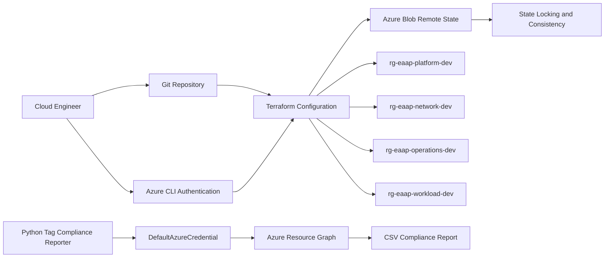

<div align="center">

# Workstream 1: Enterprise Landing Zone
### Terraform State, Resource Organization, Governance Standards, and Python Automation

**Contoso Digital Services | Microsoft Azure | Terraform | Azure Storage | Azure Resource Graph | Python**

</div>

---

## Executive Summary

I established the foundation for the Enterprise Azure Application Platform by creating a repeatable Azure landing-zone structure for development workloads.

This workstream introduced a remote Terraform backend in Azure Blob Storage, standardized naming and tagging rules, separated platform resources into purpose-built resource groups, and deployed the initial environment through Terraform. I also built a Python tag-compliance reporter that queries Azure Resource Graph and produces a CSV report showing which resources meet the project's governance standard.

> **Outcome:** The project now has a controlled Infrastructure as Code foundation, centralized remote state, consistent resource organization, and an automated method for validating tag compliance across the subscription.

---

## Project Snapshot

| Category | Details |
|---|---|
| **Platform** | Microsoft Azure |
| **Business scenario** | Standardized application platform for containerized enterprise workloads |
| **Primary focus** | Landing-zone foundation, Terraform operations, governance standards, and automation |
| **Key services** | Azure Resource Manager, Resource Groups, Azure Storage, Azure Blob Storage, Azure Resource Graph |
| **Engineering tools** | Terraform, Azure CLI, Python, Azure SDK for Python, Git |
| **Governance controls** | Naming convention, required tags, environment separation, remote state, state locking |
| **Automation** | Python tag-compliance inventory and CSV evidence report |
| **Validation** | Terraform plan/apply succeeded, state stored remotely, resource groups inherited standard tags, Python report completed |

---

## Business Context

Contoso Digital Services needs a dependable Azure platform for teams that will deploy containerized applications. Before networking, Kubernetes, CI/CD, or application services can be introduced, the organization needs a consistent foundation for resource ownership, environment separation, Terraform state, and operational governance.

Without that foundation, cloud environments commonly develop inconsistent names, missing cost and ownership metadata, unmanaged local Terraform state, and resource groups that do not reflect clear operational boundaries.

This workstream creates the platform baseline that every later deployment will inherit.

---

## Engineering Challenge

The landing zone needed to solve several foundational problems:

- Terraform state could not remain on a single engineer's workstation
- Concurrent Terraform operations needed state-locking protection
- Resource names needed to communicate workload, environment, region, and purpose
- Required tags needed to support ownership, cost visibility, and lifecycle management
- Platform, network, operations, and application resources needed clear boundaries
- The design needed to work in either a dedicated subscription or a shared portfolio subscription
- Governance validation needed to be repeatable rather than dependent on manual portal review
- No credentials could be embedded in Terraform or Python source code

---

## Architecture



---

## What I Implemented

### Terraform Remote State

A dedicated Azure Storage account and private blob container were created to store Terraform state.

The backend provides:

- Centralized state storage
- Separation between source code and state data
- Native Azure Blob state locking
- Consistency protection during Terraform operations
- A path for future CI/CD execution through GitHub Actions

The backend is bootstrapped separately because Terraform cannot use a backend that does not yet exist.

### Resource Organization

The development environment is separated into resource groups based on operational responsibility.

| Resource Group | Purpose |
|---|---|
| `rg-eaap-platform-dev` | Shared platform services and future AKS supporting resources |
| `rg-eaap-network-dev` | Hub, spoke, routing, security, and private DNS resources |
| `rg-eaap-operations-dev` | Monitoring, automation, alerting, backup, and operational tooling |
| `rg-eaap-workload-dev` | Application-specific resources and test workloads |

This structure reduces resource sprawl and creates clean scopes for RBAC, policy, budgets, monitoring, and lifecycle actions.

### Naming Convention

The project uses a predictable naming pattern:

```text
<resource-abbreviation>-<workload>-<environment>-<region>-<instance>
```

Example:

```text
vnet-eaap-dev-scus-001
```

The convention uses stable information in resource names while placing changeable business metadata in tags.

### Required Tags

| Tag | Example | Purpose |
|---|---|---|
| `Project` | `Enterprise-Azure-Application-Platform` | Connects resources to the portfolio project |
| `Environment` | `dev` | Identifies lifecycle environment |
| `ManagedBy` | `Terraform` | Identifies the deployment authority |
| `Owner` | `Cloud-Platform-Team` | Establishes operational accountability |
| `CostCenter` | `Platform-Engineering` | Supports cost allocation |
| `DataClassification` | `Internal` | Establishes a baseline data-handling category |
| `Criticality` | `Medium` | Supports operations and recovery prioritization |

### Terraform Environment Configuration

The Terraform configuration includes:

- Required Terraform and provider constraints
- AzureRM backend configuration
- AzureRM provider registration behavior
- Environment variables and reusable local values
- Standard tags applied consistently to all resource groups
- Outputs that expose deployed resource group names and IDs
- A `.gitignore` that excludes local state, plans, credentials, and generated reports

### Python Tag-Compliance Automation

The first Python automation authenticates through `DefaultAzureCredential`, queries Azure Resource Graph, and evaluates each resource against the required tag list.

The script:

- Uses the active Azure CLI session during local development
- Avoids embedded client secrets or access keys
- Queries resources at subscription scope
- Ignores resource types that do not support the same tagging behavior when configured
- Calculates a compliance percentage
- Lists missing tags for each noncompliant resource
- Exports results to a timestamped CSV file
- Returns a nonzero exit code when noncompliant resources are found, allowing later use in CI/CD

---

## Key Engineering Decisions and Tradeoffs

| Decision | Rationale | Tradeoff |
|---|---|---|
| Use Azure Blob Storage for Terraform state | Centralizes state and provides Azure-native locking and consistency | Requires a bootstrap process before normal Terraform deployment |
| Separate resource groups by operational purpose | Creates clean security, cost, monitoring, and lifecycle boundaries | Introduces more resource groups than a small lab strictly requires |
| Keep environment in names and tags | Makes resources understandable in the portal and scripts | Renaming resources later can require replacement |
| Keep changeable metadata in tags | Tags can be updated without renaming resources | Tag compliance must be monitored continuously |
| Use Terraform for the landing-zone resources | Demonstrates repeatability and reduces configuration drift | Engineers must understand state and provider behavior |
| Use Azure CLI only for backend bootstrap | Solves the Terraform backend dependency without making the portal the deployment method | Creates a small one-time procedural step outside Terraform |
| Use `DefaultAzureCredential` in Python | Supports local CLI credentials now and managed/workload identity later | Authentication behavior must be understood across environments |
| Make the Python script fail on noncompliance | Enables future pipeline quality gates | A report run can exit unsuccessfully even though the query itself worked |

---

## Implementation Issues and Resolutions

### Terraform could not create its own remote backend

**Issue:** The Azure Storage backend must exist before `terraform init` can use it.

**Resolution:** Bootstrapped the state resource group, storage account, and blob container with Azure CLI, then configured Terraform to use the existing backend.

### Storage account names must be globally unique

**Issue:** A predictable storage account name can already be in use by another Azure customer.

**Resolution:** Added a short randomized suffix during backend bootstrap and recorded the final name in an uncommitted `backend.hcl` file.

### Resource tags were not enough without validation

**Issue:** Defining a tag standard in documentation does not prove that deployed resources follow it.

**Resolution:** Added a Python Resource Graph report that evaluates actual Azure resources and exports the evidence.

### Local authentication needed to avoid secrets

**Issue:** Hardcoding service-principal secrets would create unnecessary credential risk.

**Resolution:** Used Azure CLI login for Terraform and `DefaultAzureCredential` for Python. The same code can later use GitHub workload identity or managed identity.

### Public Storage Account Creation Denied

**Issue:** An inherited Azure Policy denied storage accounts with public network access. Because the project was executed from a local workstation without private VNet connectivity, Terraform required controlled access through the storage account's public endpoint.

**Resolution:** I created a narrowly scoped policy exemption limited to the dedicated Terraform backend resource group. Anonymous blob access remained disabled, HTTPS and TLS 1.2 were enforced, and data-plane access used Microsoft Entra authentication. The planned future-state improvement is to migrate the backend to private endpoint access through an Azure-hosted or self-hosted deployment runner.

### Management-Group Policy Required the Storage Firewall to Deny Traffic by Default

**Issue:** After the resource-group exemption was created, a separate policy inherited from the management-group scope denied the storage-account deployment because `networkAcls.defaultAction` was not set to `Deny`. The policy did not require the public endpoint to be disabled; it required all network traffic to be blocked unless explicitly allowed.

**Resolution:** Instead of requesting another exemption, I configured the storage firewall with a default action of `Deny` and added a network rule for my workstation’s current public IP address. Anonymous blob access remained disabled, HTTPS and TLS 1.2 were enforced, and Terraform used Microsoft Entra authentication. This produced a policy-compliant backend that remained reachable only from the approved workstation. 


---

## Results and Validation

| Result | Validation |
|---|---|
| Remote Terraform state established | State blob exists in the dedicated Azure Storage container |
| State locking available | Backend uses Azure Blob native locking and consistency behavior |
| Environment boundaries created | Four purpose-built development resource groups deployed |
| Naming standard documented | Naming pattern and abbreviations stored with the project documentation |
| Tagging baseline applied | Terraform applies the required tag map to managed resource groups |
| Deployment is repeatable | A second `terraform plan` returns no unexpected changes |
| Source control hygiene established | State files, plan files, credentials, and generated reports are excluded |
| Governance automation completed | Python script queries Resource Graph and generates a CSV compliance report |
| Pipeline readiness improved | Python exits nonzero when missing tags are detected |

---

## Evidence

Replace each placeholder with a GitHub-hosted screenshot after completing the runbook.

| Evidence | What It Proves | Screenshot |
|---|---|---|
| Terraform backend resource group | Dedicated separation for state infrastructure |  |
| Storage account and state container | Remote state location exists |   |
| Terraform state blob | Terraform is writing state remotely |  |
| Successful Terraform apply | Infrastructure was deployed through IaC |  |
| Landing-zone resource groups | Purpose-built resource organization exists |  |
| Resource tags | Required governance metadata is applied |  |
| Clean Terraform plan | Deployed state matches the configuration |  |
| Python automation output | Automated compliance calculation completed |  |
| CSV compliance report | Script produced reusable governance evidence |  |

### Recommended Screenshot Guidance

- Crop screenshots to the relevant Azure or terminal content.
- Remove subscription IDs, tenant IDs, email addresses, access keys, and local file paths where appropriate.
- Use descriptive filenames in numerical order.
- Do not upload `.tfstate`, `backend.hcl`, credentials, or full terminal history containing secrets.

---

## Framework Alignment

| Framework or Practice | Application |
|---|---|
| **Microsoft Cloud Adoption Framework** | Resource organization, naming standards, tagging strategy, environment boundaries |
| **Infrastructure as Code** | Repeatable Terraform deployment and configuration review |
| **Zero Trust operational principles** | Identity-based authentication and no embedded credentials |
| **FinOps foundation** | Ownership, environment, project, and cost-center metadata |
| **DevOps controls** | Remote state, source-control hygiene, deterministic plans, automation exit codes |

---

## Lessons Learned

### Terraform state is production data

Terraform state can contain resource identifiers and sensitive values. It needs controlled storage, locking, access governance, and separation from the public source repository.

### A landing zone should establish operational boundaries

Resource groups are not merely folders. They become scopes for RBAC, policy, budgets, monitoring, deployment, and deletion. Structuring them early prevents later rework.

### Naming and tagging solve different problems

Names should contain stable identifying information. Tags should contain metadata that may change, such as ownership, cost allocation, and criticality.

### Governance needs automated evidence

A documented standard does not guarantee compliance. Querying the live environment with Python turns governance from a one-time checklist into a repeatable operational control.

### Authentication design should anticipate automation

Using Azure CLI credentials locally and `DefaultAzureCredential` in code makes it easier to move the same automation into GitHub Actions or an Azure-hosted runtime without rewriting authentication logic.

---

## Skills Demonstrated

`Microsoft Azure` · `Terraform` · `Azure Storage` · `Remote State` · `Azure CLI` · `Python` · `Azure SDK` · `Azure Resource Graph` · `Cloud Governance` · `Naming and Tagging` · `Git` · `Infrastructure as Code`

---

## Repository Navigation

- **Next workstream:** Workstream 2 — Enterprise Networking
- **Python automation:** [Tag Compliance Reporter](../../automation/tag-compliance/tag_compliance_report.py)
- **Detailed implementation:** [Workstream 1 Runbook](../../runbooks/phase-1-landing-zone-runbook.md)
- **Project overview:** [Enterprise Azure Application Platform](../../README.md)

---

<div align="center">

**Workstream 1 complete — the platform now has a repeatable, governed, and automation-ready Azure foundation.**

</div>
