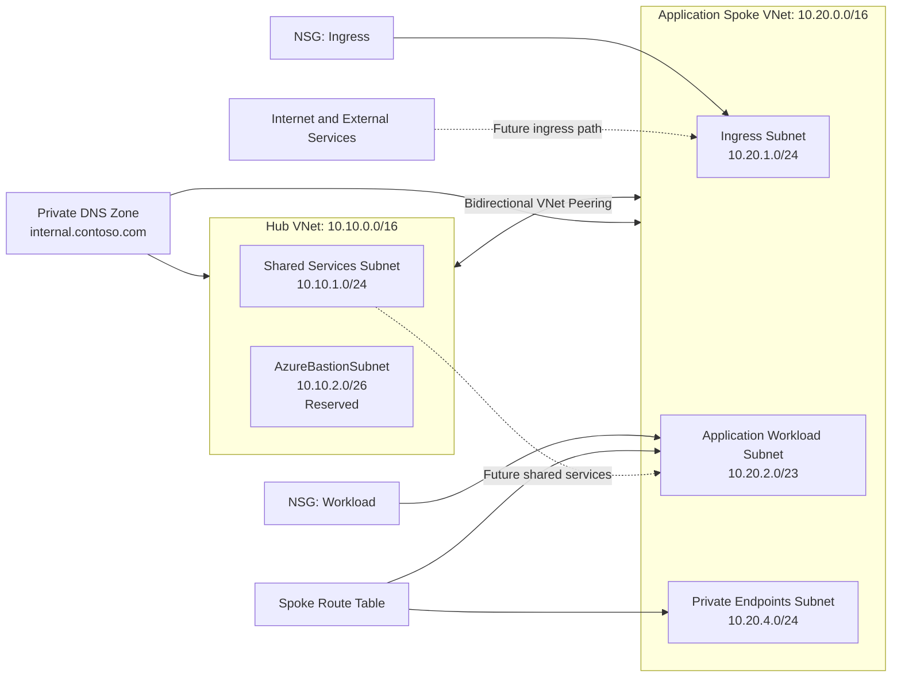

# Workstream 2: Enterprise Networking
### Hub-and-Spoke Connectivity, Segmented Subnets, NSGs, Route Control, and Private DNS

**Contoso Digital Services | Microsoft Azure | Terraform | Azure Virtual Network | Network Security Groups | Private DNS**

---

## Executive Summary

I designed and deployed the network foundation for the Enterprise Azure Application Platform using Terraform.

This workstream introduced a hub-and-spoke topology, non-overlapping address spaces, purpose-built subnets, bidirectional virtual network peering, subnet-level network security groups, route-table associations, and a centralized Azure Private DNS zone linked to both networks.

> **Outcome:** The platform now has a segmented and extensible network foundation that can support future private endpoints, AKS, ingress, monitoring, and shared platform services without relying on flat or manually configured networking.

---

## Project Snapshot

| Category | Details |
|---|---|
| **Platform** | Microsoft Azure |
| **Business scenario** | Secure network foundation for an enterprise application platform |
| **Primary focus** | Network segmentation, controlled connectivity, routing foundation, and private name resolution |
| **Key services** | Azure Virtual Network, Subnets, VNet Peering, Network Security Groups, Route Tables, Azure Private DNS |
| **Engineering tools** | Terraform, Azure CLI, Git, Visual Studio Code |
| **Deployment model** | Terraform-managed infrastructure using the Phase 1 remote backend |
| **Validation** | Terraform plan/apply, peering state, subnet associations, DNS links, clean follow-up plan |

---

## Business Context

Contoso Digital Services needs a secure network foundation before application platforms and shared services are deployed. A flat virtual network would make it difficult to separate ingress, application workloads, private endpoints, and shared platform services.

The organization also needs an architecture that can grow without forcing major IP-address changes or introducing overlapping address spaces. The network must support future services such as AKS, Azure Container Registry, Key Vault, private endpoints, monitoring components, and centralized security controls.

The EAAP environment shares an Azure subscription with the Enterprise Azure AI Infrastructure project. Network separation is therefore enforced through dedicated EAAP resource groups, non-overlapping address spaces, project-specific tags, and an independent Terraform state key.

---

## Engineering Challenge

The network design needed to solve the following problems:

- Separate shared platform connectivity from application workloads
- Prevent overlapping IP address spaces
- Reserve subnet capacity for future services
- Establish controlled hub-to-spoke communication
- Create subnet-level security boundaries
- Provide an extension point for future forced tunneling through Azure Firewall
- Establish private DNS resolution across both virtual networks
- Keep the entire design reproducible through Terraform
- Avoid deploying expensive network appliances before they are needed

---

## Target Architecture

---

## Addressing Plan

| Network | Address Space | Purpose |
|---|---|---|
| Hub VNet | `10.10.0.0/16` | Shared connectivity and future centralized services |
| Application Spoke VNet | `10.20.0.0/16` | Application platform and workload resources |

### Hub Subnets

| Subnet | CIDR | Purpose |
|---|---|---|
| `snet-shared-services-dev-scus-001` | `10.10.1.0/24` | Future DNS, management, or shared platform services |
| `AzureBastionSubnet` | `10.10.2.0/26` | Reserved for a future Azure Bastion deployment |

### Application Spoke Subnets

| Subnet | CIDR | Purpose |
|---|---|---|
| `snet-ingress-dev-scus-001` | `10.20.1.0/24` | Future ingress or application gateway components |
| `snet-workload-dev-scus-001` | `10.20.2.0/23` | Future AKS nodes and application workloads |
| `snet-private-endpoints-dev-scus-001` | `10.20.4.0/24` | Private endpoints for Azure PaaS services |

The ranges intentionally leave unused space for future subnets without redesigning the entire network.

---

## What I Implemented

### Hub-and-Spoke Virtual Networks

The hub VNet provides the future location for shared network services. The application spoke isolates application-platform resources from shared infrastructure.

Bidirectional VNet peering provides direct private connectivity between the hub and spoke while preserving separate address spaces and resource boundaries.

### Purpose-Built Subnets

Subnets are organized by function rather than placing all resources into one address range. This supports targeted NSGs, route-table associations, service delegation, private endpoints, and future lifecycle decisions.

### Network Security Groups

Two NSGs establish security-control boundaries for ingress and application workloads.

The initial rules document the intended application flow:

- HTTPS is allowed from the ingress subnet to the workload subnet
- Other inbound traffic to the workload subnet is denied before Azure default allow rules
- Ingress remains closed to unsolicited inbound traffic until an approved ingress service is deployed

Workload-specific rules will be expanded alongside AKS and ingress deployment instead of opening broad access prematurely.

### Route-Table Foundation

A spoke route table is associated with the workload and private-endpoint subnets.

The route table is intentionally created without a forced-tunneling route in this workstream because Azure Firewall or another approved next-hop appliance has not yet been deployed. This avoids creating a route to a nonexistent next hop while preserving the Terraform-managed association point for a later security phase.

### Centralized Private DNS

A private DNS zone named `internal.contoso.com` is linked to both VNets.

This creates a controlled internal namespace and validates the virtual-network-link pattern that later private endpoint zones will use. Automatic registration is disabled so records remain intentional and Terraform-controlled.

---

## Key Engineering Decisions and Tradeoffs

| Decision | Rationale | Tradeoff |
|---|---|---|
| Use hub-and-spoke instead of one flat VNet | Separates shared services from application workloads and supports future growth | Requires peering and additional network objects |
| Allocate `/16` VNet ranges | Provides room for future subnets and avoids early renumbering | Reserves more private address space than the lab immediately uses |
| Use purpose-built subnets | Enables targeted security, routing, and service delegation | Requires more planning than a single large subnet |
| Reserve `AzureBastionSubnet` | Prevents future address-plan disruption | Subnet remains unused until Bastion is deployed |
| Create route-table associations without forced tunneling | Establishes the control point without routing traffic to a nonexistent firewall | No centralized egress inspection yet |
| Link private DNS to both VNets | Provides consistent private name-resolution scope | Additional zones will still be required for specific Private Link services |
| Disable DNS auto-registration | Keeps records controlled and avoids unintended record creation | Records must be created intentionally |
| Delay Azure Firewall | Controls cost and keeps this workstream focused on the network foundation | Central inspection and forced tunneling are deferred |

---

## Implementation Issues and Resolutions

### Phase 1 backend dependency

**Issue:** Terraform networking cannot be deployed until the Phase 1 remote backend and landing-zone resource groups are completed in the correct subscription.

**Resolution:** Treat Workstream 2 deployment as blocked until the shared portfolio subscription is selected, the EAAP backend exists, and the Phase 1 Terraform state is healthy. EAAP remains isolated from the Azure AI project through dedicated resource groups, project tags, and a separate Terraform state key.

### Avoiding meaningless custom routes

**Issue:** A default route to a firewall cannot be created safely before a firewall or other virtual appliance exists.

**Resolution:** Created the route-table resource and subnet associations but deferred custom forced-tunneling routes to the platform-security phase.

### Security rules must anticipate later services

**Issue:** Overly restrictive NSGs can prevent AKS, ingress, health probes, or private endpoint traffic from working later.

**Resolution:** Applied a narrow baseline and documented that service-specific rules must be added in the same change set as the dependent service.

---

## Results and Validation

| Result | Validation |
|---|---|
| Hub and spoke networks created | Both VNets appear in the network resource group with expected CIDRs |
| Address spaces do not overlap | Terraform configuration and portal address-space views match the plan |
| Bidirectional peering established | Both peerings report `Connected` |
| Subnet segmentation applied | Five purpose-built subnets exist with expected prefixes |
| NSG boundaries established | NSGs are associated with the intended subnets |
| Route-control extension point established | Route table is associated with workload and private-endpoint subnets |
| Private DNS foundation created | Zone exists with links to both VNets |
| Infrastructure is reproducible | Terraform apply succeeds and a second plan reports no changes |

---

## Evidence

| Evidence | What It Proves | Screenshot |
|---|---|---|
| Hub and spoke VNets | Separate network boundaries and address spaces exist |  |
| Hub subnets | Shared-services and Bastion capacity are reserved |   |
| Spoke subnets | Ingress, workload, and private endpoints are segmented |  |
| Connected peerings | Private hub-to-spoke connectivity is established |    |
| Network security groups | Subnet-level controls exist |  |
| Route-table associations | Routing control is attached to intended subnets |  | 
| Private DNS zone and links | Centralized private DNS foundation is active |  |
| Terraform plan | Networking was deployed through IaC | |
| Clean Terraform plan | Azure and Terraform state are synchronized | |

---

## Framework Alignment

| Framework or Practice | Application |
|---|---|
| **Microsoft Cloud Adoption Framework** | Hub-and-spoke organization, IP planning, network segmentation |
| **Zero Trust** | Explicit traffic boundaries and private connectivity foundation |
| **Infrastructure as Code** | Terraform-defined networks, peerings, NSGs, routes, and DNS |
| **Defense in Depth** | VNet boundaries, subnet segmentation, NSGs, routing controls |
| **Operational Readiness** | Reserved capacity, standardized names, outputs, validation evidence |

---

## Lessons Learned

### Address planning is difficult to change later

Non-overlapping ranges and reserved capacity reduce the risk of renumbering when additional services and environments are introduced.

### Peering provides connectivity, not complete security

VNet peering connects networks privately, but NSGs, route tables, DNS, identity, and service-level controls are still required.

### NSGs and route tables solve different problems

NSGs decide whether traffic is allowed or denied. Route tables decide where traffic is sent. Both controls are necessary, but they are not interchangeable.

### Private DNS must be designed with the network

Private connectivity is incomplete when names still resolve to public addresses. DNS links and private endpoint zones must be treated as part of the connectivity design.

### Security controls should be introduced with their dependencies

A route to Azure Firewall should not exist before the firewall exists, and AKS-specific NSG rules should not be guessed before the cluster design is finalized.

---

## Skills Demonstrated

`Azure Virtual Network` · `Hub-and-Spoke` · `Subnet Design` · `CIDR Planning` · `VNet Peering` · `Network Security Groups` · `Route Tables` · `Azure Private DNS` · `Terraform` · `Azure CLI` · `Infrastructure as Code`

---

## Repository Navigation

- **Detailed implementation:** [Workstream 2 Runbook](../../runbooks/phase-2-enterprise-networking-runbook.md)
- **Previous workstream:** [Workstream 1 — Enterprise Landing Zone](../phase-1-landing-zone/README.md)
- **Next workstream:** Workstream 3 — Identity and Secrets
- **Project overview:** [Enterprise Azure Application Platform](../../README.md)

---

**Workstream 2 complete — the platform now has a segmented, private-connectivity-ready Azure network foundation.**

