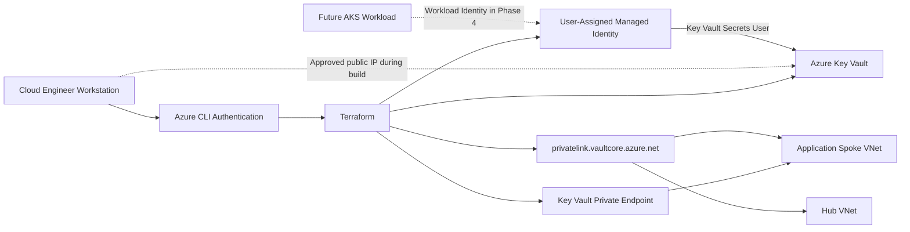

<div align="center">

# Workstream 3: Identity and Secrets
### Managed Identity, Azure RBAC, Key Vault, Private Endpoint, and Controlled Secret Access

**Contoso Digital Services | Microsoft Azure | Terraform | Microsoft Entra ID | Azure Key Vault | Private Link**

</div>

---

## Executive Summary

I extended the Enterprise Azure Application Platform with an identity and secrets foundation designed to remove embedded credentials from application and infrastructure workflows.

This workstream introduces a user-assigned managed identity for future AKS workloads, an Azure Key Vault configured for Azure RBAC authorization, a private endpoint in the application private-endpoints subnet, and private DNS links for both the hub and application VNets. Administrative data-plane access is temporarily limited to one approved workstation public IP so a test secret can be created without placing the secret value in Terraform state.

> **Outcome:** The platform now has a controlled secret store, identity-based authorization, private network access for future workloads, and a clear migration path from local engineering access to AKS workload identity.

---

## Project Snapshot

| Category | Details |
|---|---|
| **Platform** | Microsoft Azure |
| **Business scenario** | Secure identity and secret-delivery foundation for an enterprise application platform |
| **Primary focus** | Managed identity, least-privilege RBAC, Key Vault hardening, Private Link, and DNS |
| **Key services** | Microsoft Entra ID, User-Assigned Managed Identity, Azure Key Vault, Azure RBAC, Private Endpoint, Private DNS |
| **Engineering tools** | Terraform, Azure CLI, PowerShell, Git, Visual Studio Code |
| **Deployment model** | Added to the existing EAAP Terraform environment and remote state |
| **Validation** | Terraform plan/apply, RBAC assignments, private endpoint connection, DNS links, secret creation, clean follow-up plan |

---

## Business Context

Applications need access to API keys, database credentials, certificates, and other sensitive values. Storing those values in Terraform files, source control, container images, or Kubernetes manifests would create unnecessary exposure.

The platform therefore needs a centralized secret store and an identity model that allows applications to request secrets without carrying long-lived credentials.

---

## Engineering Challenge

The design needed to:

- Eliminate secrets from Terraform source files
- Avoid storing test-secret values in Terraform state
- Give future AKS workloads an Azure identity
- Use Azure RBAC instead of legacy Key Vault access policies
- Restrict Key Vault network access
- Resolve the Key Vault private endpoint from both VNets
- Preserve local engineering access during the build phase
- Prepare for Microsoft Entra Workload ID in Workstream 4
- Continue using the existing EAAP Terraform state

---

## Target Architecture



---

## What I Implemented

### User-Assigned Managed Identity

A reusable user-assigned managed identity is created for the sample application workload. This separates the application identity from the human engineer, Terraform identity, AKS control-plane identity, and AKS kubelet identity.

### Azure Key Vault with RBAC

The Key Vault is configured with Azure RBAC authorization, soft-delete retention, purge protection, deny-by-default network rules, and no secret values stored in Terraform.

### Private Endpoint and Private DNS

The Key Vault private endpoint is placed in:

```text
snet-private-endpoints-dev-scus-001
```

The private DNS zone is:

```text
privatelink.vaultcore.azure.net
```

The zone is linked to both the hub and application VNets.

### Controlled Administrative Access

During local development, the Key Vault public endpoint remains enabled while its firewall denies traffic by default. Only the current workstation public IP is allowed. After AKS workload identity is validated, this temporary rule can be removed.

### Secret Creation Outside Terraform

The test secret is created with Azure CLI after deployment so its value does not appear in Terraform configuration, plan output, state, or Git history.

---

## Key Engineering Decisions and Tradeoffs

| Decision | Rationale | Tradeoff |
|---|---|---|
| Use a user-assigned managed identity | Creates a reusable workload identity independent of the cluster lifecycle | Requires explicit federation and RBAC |
| Use Key Vault RBAC authorization | Aligns secret access with Azure role assignments | Role propagation can delay testing |
| Use a private endpoint | Gives future workloads a private data path | Requires Private DNS configuration |
| Temporarily allow one workstation IP | Enables local validation | Public endpoint remains enabled during the build phase |
| Create the secret outside Terraform | Keeps secret plaintext out of Terraform state | Secret creation becomes a controlled post-deployment step |
| Enable purge protection | Protects against immediate permanent deletion | Vault deletion cannot be immediately purged |
| Continue the existing Terraform state | Keeps the platform managed as one environment | Later workstreams must preserve state continuity |

---

## Implementation Issues Anticipated

### Key Vault name uniqueness

Key Vault names are globally unique.

**Resolution:** Supply a unique name through ignored `terraform.tfvars` while committing only an example value.

### RBAC propagation

New role assignments can take several minutes to become effective.

**Resolution:** Validate the assignment and allow propagation time before treating a data-plane authorization error as a design failure.

### Private-only access versus local administration

A fully private Key Vault cannot be reached directly from a workstation without VNet connectivity.

**Resolution:** Use a deny-by-default firewall with one temporary workstation IP during the build phase, then remove it after AKS-based secret access is validated.

### Secret values and Terraform state

Managing a secret value with Terraform writes the value into state.

**Resolution:** Terraform manages the vault and permissions; Azure CLI creates the test secret afterward.

---

## Results and Validation

| Result | Validation |
|---|---|
| Workload identity created | User-assigned identity exists in the platform resource group |
| Key Vault hardened | RBAC, purge protection, soft delete, and firewall settings match the design |
| Least-privilege access established | Workload identity has Key Vault Secrets User |
| Administrative access established | Current engineer has Key Vault Administrator |
| Private connectivity established | Private endpoint reports Approved |
| Private name resolution prepared | Private DNS links exist for hub and spoke |
| Secret kept out of Terraform state | Test secret created through Azure CLI after apply |
| Deployment remains stable | Follow-up Terraform plan reports no changes |

---

## Evidence

| Evidence | What It Proves | Screenshot |
|---|---|---|
| Managed identity | Workload identity exists | `../../screenshots/phase-3/01-managed-identity.png` |
| Key Vault overview | Vault deployed in the platform resource group | `../../screenshots/phase-3/02-key-vault-overview.png` |
| Key Vault networking | Firewall and private endpoint configuration | `../../screenshots/phase-3/03-key-vault-networking.png` |
| Private endpoint | Approved private connection | `../../screenshots/phase-3/04-key-vault-private-endpoint.png` |
| Private DNS zone | Key Vault Private Link zone and VNet links | `../../screenshots/phase-3/05-key-vault-private-dns.png` |
| RBAC assignments | Administrator and workload reader roles | `../../screenshots/phase-3/06-key-vault-rbac.png` |
| Secret metadata | Test secret exists without exposing its value | `../../screenshots/phase-3/07-test-secret-metadata.png` |
| Terraform apply | Identity and secrets resources deployed | `../../screenshots/phase-3/08-terraform-apply.png` |
| Clean plan | Configuration and Azure are synchronized | `../../screenshots/phase-3/09-clean-plan.png` |

---

## Skills Demonstrated

- Microsoft Entra managed identities
- Azure RBAC and least privilege
- Azure Key Vault security configuration
- Private Endpoint and Private DNS
- Terraform state continuity
- Secret-management tradeoffs
- Secure local administration
- Infrastructure validation and documentation

---

## Next Workstream

**Workstream 4 — Container Platform** deploys Azure Container Registry, Azure Kubernetes Service, system and user node pools, OIDC issuer, Microsoft Entra Workload ID, Key Vault CSI integration, and private application exposure.
