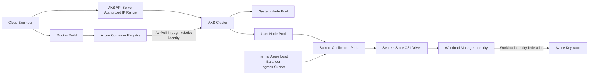

<div align="center">

# Workstream 4: Container Platform
### Azure Container Registry, AKS, Node Pools, Workload Identity, Key Vault CSI, and Private Service Exposure

**Contoso Digital Services | Microsoft Azure | Terraform | Docker | Azure Container Registry | Azure Kubernetes Service**

</div>

---

## Executive Summary

I deployed the first container platform layer for the Enterprise Azure Application Platform.

This workstream introduces Azure Container Registry, an Azure Kubernetes Service cluster attached to the existing workload subnet, separate system and user node pools, Microsoft Entra integration, OIDC issuer, Workload Identity, Azure Key Vault Secrets Store CSI integration, and a private Azure Load Balancer frontend placed in the dedicated ingress subnet.

> **Outcome:** The platform can build and store container images, run replicated workloads on AKS, pull images through managed identity, retrieve secrets through workload identity, and expose an application privately without giving the workload nodes public IP addresses.

---

## Project Snapshot

| Category | Details |
|---|---|
| **Platform** | Microsoft Azure |
| **Business scenario** | Managed container platform for enterprise application workloads |
| **Primary focus** | Container registry, Kubernetes cluster, node-pool separation, identity, secret delivery, and private exposure |
| **Key services** | Azure Container Registry, Azure Kubernetes Service, Microsoft Entra Workload ID, Key Vault CSI Driver, Azure Load Balancer |
| **Engineering tools** | Terraform, Azure CLI, Docker, kubectl, PowerShell, Git |
| **Deployment model** | Added to the existing EAAP Terraform environment and remote state |
| **Validation** | Image push, cluster access, node readiness, workload identity, secret mount, service private IP, replica health, clean plan |

---

## Business Context

The landing zone, network foundation, and secrets platform are available, but the organization still needs a managed runtime for containerized applications.

The platform must separate system components from application workloads, avoid static cloud credentials, retrieve secrets securely, and expose services through a controlled network entry point.

---

## Engineering Challenge

The design needed to:

- Reuse the existing workload and ingress subnets
- Avoid public IP addresses on AKS nodes
- Separate system and user workloads
- Restrict Kubernetes API access to the approved workstation
- Allow AKS to pull images without ACR admin credentials
- Give pods access to Key Vault without Azure client secrets
- Preserve the Phase 2 deny-by-default NSG design
- Place the service frontend in the ingress subnet
- Keep the platform cost-aware
- Avoid relying on a legacy ingress controller with a near-term support deadline

---

## Target Architecture



---

## What I Implemented

### Azure Container Registry

The registry stores the project container images.

Security controls include:

- Admin user disabled
- Microsoft Entra authentication
- `AcrPush` for the engineer during local validation
- `AcrPull` for the AKS kubelet identity
- No registry password embedded in Kubernetes manifests

### Azure Kubernetes Service

The cluster uses:

- The existing application workload subnet
- Azure CNI Overlay networking
- System-assigned cluster identity
- Microsoft Entra integration
- Azure RBAC for Kubernetes authorization
- OIDC issuer
- Microsoft Entra Workload ID
- Key Vault Secrets Store CSI add-on
- API server authorized IP ranges
- No public IP addresses on nodes

### System and User Node Pools

The system node pool hosts critical Kubernetes and AKS components.

A separate user node pool hosts the sample application. This creates a foundation for independent scaling, workload scheduling, different VM sizes, and separate lifecycle decisions.

### Workload Identity Federation

The Kubernetes service account is federated to the user-assigned managed identity created in Workstream 3.

The application can request Key Vault access without client secrets, service-principal passwords, or Azure credentials stored in a Kubernetes Secret.

### Private Service Exposure

The sample application is exposed through an internal Azure Load Balancer.

The frontend private IP is allocated from:

```text
snet-ingress-dev-scus-001
```

The application pods remain in the AKS workload subnet.

This validates:

```text
Approved internal client
        ↓
Ingress subnet private frontend
        ↓
AKS workload nodes and pods
```

This workstream establishes private Layer 4 exposure. A later phase can add Kubernetes Gateway API or Application Gateway for Containers for Layer 7 routing, TLS policy, WAF, and traffic splitting.

---

## Key Engineering Decisions and Tradeoffs

| Decision | Rationale | Tradeoff |
|---|---|---|
| Use AKS | Azure manages the Kubernetes control plane and integrates with Azure identity and networking | Engineers still manage node pools, upgrades, policy, and workloads |
| Use Azure CNI Overlay | Conserves VNet IP space while preserving Azure networking integration | Pod networking differs from traditional flat Azure CNI |
| Use separate system and user pools | Separates platform components from application workloads | Requires at least two node pools |
| Restrict the API server by IP | Allows local administration without internet-wide API exposure | Public IP changes require an update |
| Disable ACR admin credentials | Enforces identity-based image access | Engineers and pipelines need explicit RBAC |
| Use Workload Identity | Removes long-lived Azure credentials from pods | Requires OIDC, federation, service-account annotations, and RBAC |
| Use a private LoadBalancer service | Validates the ingress subnet without exposing the application publicly | Direct testing requires VNet connectivity or port forwarding |
| Defer full Layer 7 ingress | Avoids a transitional ingress controller and keeps the phase focused | Gateway API, WAF, and TLS routing are deferred |

---

## Implementation Issues Anticipated

### Existing NSG blocks AKS traffic

The Phase 2 workload NSG contains an explicit deny rule.

**Resolution:** Add explicit rules for workload-subnet internal traffic and Azure Load Balancer traffic before creating AKS.

### AKS needs permission on the ingress subnet

The internal Load Balancer frontend is created in a subnet different from the AKS node subnet.

**Resolution:** Give the AKS cluster identity Network Contributor on the ingress subnet.

### ACR pull authorization

Creating AKS and ACR does not automatically guarantee image-pull access.

**Resolution:** Assign `AcrPull` to the AKS kubelet identity at the registry scope.

### Federation depends on the AKS OIDC issuer

The federated credential cannot be completed until the cluster exposes its issuer URL.

**Resolution:** Enable OIDC and Workload Identity on the cluster, then create the federated credential from the issuer URL.

---

## Results and Validation

| Result | Validation |
|---|---|
| Registry deployed | ACR exists with admin user disabled |
| Container image published | Repository and tag appear in ACR |
| AKS operational | Cluster provisioning state is Succeeded |
| Node pools separated | System and user pools both report Ready nodes |
| API access restricted | Authorized IP range contains only approved ranges |
| Image pulls use identity | AKS kubelet identity has AcrPull |
| Pod secret access uses federation | Pod mounts a Key Vault value without an Azure client secret |
| Application replicated | Two sample application pods report Ready |
| Private exposure created | LoadBalancer receives a private IP in the ingress subnet |
| Platform synchronized | Follow-up Terraform plan reports no changes |

---

## Evidence

| Evidence | What It Proves | Screenshot |
|---|---|---|
| ACR overview | Registry exists with expected settings | `../../screenshots/phase-4/01-acr-overview.png` |
| ACR repository | Sample image was pushed | `../../screenshots/phase-4/02-acr-image.png` |
| AKS overview | Cluster deployed successfully | `../../screenshots/phase-4/03-aks-overview.png` |
| Node pools | System and user pools exist | `../../screenshots/phase-4/04-node-pools.png` |
| Authorized IP ranges | API server access is restricted | `../../screenshots/phase-4/05-api-authorized-ip.png` |
| Workload identity | OIDC and federation are configured | `../../screenshots/phase-4/06-workload-identity.png` |
| Key Vault CSI | SecretProviderClass and mounted secret validated | `../../screenshots/phase-4/07-key-vault-secret-mount.png` |
| Running workload | Two application pods are Ready | `../../screenshots/phase-4/08-running-pods.png` |
| Private service IP | Service uses an ingress-subnet private IP | `../../screenshots/phase-4/09-private-service-ip.png` |
| Clean plan | Terraform and Azure remain synchronized | `../../screenshots/phase-4/10-clean-plan.png` |

---

## Skills Demonstrated

- Docker image build and registry workflows
- Azure Container Registry RBAC
- AKS cluster and node-pool design
- Azure CNI Overlay
- Kubernetes administration with kubectl
- Microsoft Entra integration and Azure RBAC
- OIDC and Workload Identity federation
- Key Vault CSI secret delivery
- Internal load balancing and subnet permissions
- Terraform dependency management
- Cost and security tradeoff analysis

---

## Next Workstream

**Workstream 5 — CI/CD Automation** will use GitHub Actions and workload identity federation to validate Terraform, build the application image, push to ACR, and deploy Kubernetes manifests without long-lived cloud credentials.
