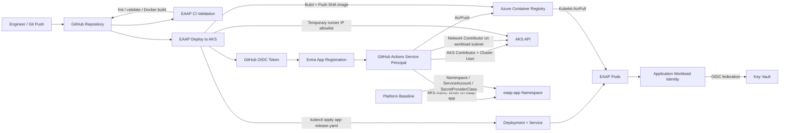

<div align="center">

# Workstream 5: CI/CD Automation
### GitHub Actions, OIDC Federation, ACR Publishing, and Controlled AKS Deployment

**Contoso Digital Services | Microsoft Azure | GitHub Actions | Terraform | Microsoft Entra ID | ACR | AKS**

</div>

---

## Executive Summary

I implemented a working CI/CD path for the Enterprise Azure Application Platform so application changes can be validated, packaged, published, and deployed to AKS without storing a long-lived Azure client secret in GitHub.

The final design uses a dedicated Microsoft Entra application registration and service principal for GitHub Actions, branch-scoped OpenID Connect (OIDC) federation, Azure RBAC, Azure Container Registry, and a least-privilege Kubernetes deployment model. GitHub Actions builds a Git-SHA-tagged container image, pushes it to ACR, temporarily authorizes the hosted runner to the restricted AKS API, deploys only application release objects, validates the rollout, and restores the original AKS API allowlist.

> **Outcome:** The EAAP deployment workflow completed successfully end to end: GitHub OIDC authentication, ACR publishing, AKS authentication, application deployment, rollout validation, and API allowlist restoration.

---

## Project Snapshot

| Category | Details |
|---|---|
| **Platform** | Microsoft Azure + GitHub Actions |
| **Business scenario** | Automated delivery for an enterprise AKS application platform |
| **Primary focus** | CI validation, secretless OIDC authentication, ACR publishing, controlled AKS deployment |
| **Key services** | Microsoft Entra ID, GitHub Actions, Azure Container Registry, AKS, Azure RBAC |
| **Engineering tools** | Terraform, AzureAD provider, AzureRM provider, GitHub Actions YAML, Docker, Azure CLI, kubectl, kubelogin, Git |
| **Deployment identity** | Entra application registration + service principal |
| **OIDC trust** | Branch-scoped flexible federated identity credential for `main` using GitHub immutable repository identity |
| **Kubernetes scope** | Application Deployment + Service in `eaap-app`; platform CRDs remain outside the CD pipeline |
| **Validation** | CI pass, OIDC login, ACR image push, AKS rollout, two Ready replicas, allowlist restoration, clean Terraform plan |

---

## Business Context

The AKS platform was already healthy, but application delivery still depended on manual workstation commands. That created avoidable operational risk:

- Image builds were not automatically tied to Git commits.
- ACR publishing depended on the engineer workstation.
- AKS deployment required interactive access.
- Release steps were harder to audit and repeat.
- A failed manual sequence could leave the API allowlist changed.

The goal was to create an automated path from Git commit to AKS while preserving the security controls built in earlier workstreams.

---

## Final Architecture



---

## Identity Separation

The final implementation keeps five identities or trust boundaries separate:

```text
Human engineer identity       -> interactive administration
AKS cluster identity          -> Azure networking/control-plane operations
AKS kubelet identity          -> ACR image pull
Application workload identity -> Key Vault secret access
GitHub Actions service principal -> automated build and deployment
```

The GitHub deployment identity does **not** replace the application workload identity. Pods continue to use the existing `id-eaap-workload-dev-scus-001` workload identity for Key Vault access.

---

## What I Implemented

### Entra Application Registration and Service Principal

The original GitHub user-assigned managed identity design was replaced with:

```text
app-eaap-github-actions-dev
        ↓
Service Principal
        ↓
Azure RBAC
```

Terraform manages the application registration, service principal, and RBAC assignments.

The AzureAD provider was added alongside AzureRM so Entra application objects can be managed as infrastructure as code.

### Branch-Scoped OIDC Federation

GitHub repositories created under the newer immutable-subject model include immutable owner and repository IDs in the OIDC `sub` claim.

During execution, standard environment-scoped federation repeatedly returned `AADSTS700213`. I isolated the token exchange with a minimal workflow, decoded the live GitHub JWT claims, validated the Entra configuration, and switched to a branch-scoped flexible federated credential.

The working trust restricts the token to:

- GitHub issuer `https://token.actions.githubusercontent.com`
- the EAAP repository
- the `main` branch
- the immutable GitHub `repository_id`
- audience `api://AzureADTokenExchange`

No Azure client secret is stored in GitHub.

### Repository-Scoped GitHub Configuration

Because the working deployment does not use:

```yaml
environment: dev
```

the Azure identifiers and deployment variables are stored at repository scope.

Repository secrets:

```text
AZURE_CLIENT_ID
AZURE_TENANT_ID
AZURE_SUBSCRIPTION_ID
```

Repository variables:

```text
ACR_NAME
ACR_LOGIN_SERVER
AKS_RESOURCE_GROUP
AKS_NAME
K8S_NAMESPACE
```

### Scoped Azure RBAC

The service principal receives only the permissions needed for the pipeline:

| Role | Scope | Purpose |
|---|---|---|
| `AcrPush` | EAAP ACR | Push Git-SHA-tagged images |
| `Azure Kubernetes Service Contributor Role` | AKS cluster | Update the temporary API authorized-IP list |
| `Azure Kubernetes Service Cluster User Role` | AKS cluster | Retrieve user kubeconfig |
| `Azure Kubernetes Service RBAC Writer` | `eaap-app` namespace | Update application resources |
| `Network Contributor` | AKS workload subnet | Satisfy linked subnet authorization required by AKS updates |

### CI Validation

The CI workflow validates:

- `terraform fmt -check -recursive`
- `terraform init -backend=false`
- `terraform validate`
- Docker image build

CI does not run `terraform apply`.

An early CI failure exposed that Phase 3 Terraform source files had not all been committed even though the resources already existed in Azure. The missing source files were added so the full root module could validate from a clean GitHub checkout.

### Immutable Image Publishing

Images are tagged with a shortened Git commit SHA:

```text
acreaapdev5803.azurecr.io/eaap-sample-web:<12-character-git-sha>
```

This creates traceability between source code, image, and deployment.

### Controlled AKS API Access

The AKS API remains restricted by authorized IP ranges.

The deployment workflow:

1. Reads the existing authorized ranges.
2. Converts them to a single comma-separated value.
3. Waits until AKS is not processing another update.
4. Detects the GitHub runner public IP.
5. Temporarily adds only that `/32`.
6. Performs the deployment.
7. Waits for AKS to become idle again.
8. Restores the exact original authorized ranges in an `always()` cleanup step.

### Platform Baseline vs Application Release

The original `platform.yaml` contained:

```text
Namespace
ServiceAccount
SecretProviderClass
Deployment
Service
```

The GitHub service principal could update normal application resources but was intentionally not granted broad custom-resource permissions for the Key Vault CSI `SecretProviderClass`.

The final design separates:

```text
platform.yaml
-> platform/security baseline
-> Namespace
-> ServiceAccount
-> SecretProviderClass

app-release.yaml
-> application release
-> Deployment
-> Service
```

GitHub Actions deploys only `app-release.yaml`.

This preserved least privilege instead of granting cluster-admin or broad CRD access to the deployment identity.

---

## Troubleshooting and Engineering Decisions

### 1. Terraform validation failed in GitHub

**Symptom:** `terraform validate` referenced undeclared Phase 3 resources and `data.azurerm_client_config.current`.

**Root cause:** Required Terraform source files existed locally but were not committed to GitHub.

**Resolution:** Commit the complete Terraform root module so CI validates the same configuration used by the workstation.

**Lesson:** Remote state does not replace source code. A clean CI runner needs the complete Terraform configuration.

### 2. OIDC federation returned `AADSTS700016` and `AADSTS700213`

**Symptoms:**

- application identifier not found
- no matching federated identity record
- standard environment subject matched visually but token exchange still failed

**Troubleshooting performed:**

- verified client ID, object ID, tenant ID, and service principal
- upgraded `azure/login` to `v3`
- inspected the live GitHub OIDC JWT claims
- verified issuer, audience, subject, repository ID, owner ID, and branch
- created an isolated branch-only OIDC workflow
- tested standard and flexible FIC matching
- identified the working branch-scoped flexible FIC pattern

**Final resolution:** Entra application registration + service principal with branch-scoped flexible federation using the immutable GitHub repository identity.

### 3. `LinkedAuthorizationFailed` during `az aks update`

**Symptom:** The service principal had AKS write permission but lacked:

```text
Microsoft.Network/virtualNetworks/subnets/join/action
```

on `snet-workload-dev-scus-001`.

**Resolution:** Add `Network Contributor` at the workload-subnet scope.

### 4. kubelogin setup failed

**Symptom:**

```text
GITHUB_TOKEN is not set, unable to resolve the latest version of kubelogin
```

**Resolution:** Pin the tested kubelogin version in the workflow:

```yaml
with:
  kubelogin-version: "v0.2.18"
```

### 5. `$GITHUB_ENV` rejected AKS IP ranges

**Symptom:**

```text
Unable to process file command 'env'
Invalid format '<CIDR>'
```

**Root cause:** AKS returned multiple authorized ranges on separate lines.

**Resolution:** Read the list as JSON and use `jq` to join it into one comma-separated value before writing to `$GITHUB_ENV`.

### 6. AKS rejected overlapping update operations

**Symptom:**

```text
OperationNotAllowed
there's an in-progress update managed cluster operation
```

**Resolution:** Add explicit wait loops before the temporary allowlist update and before restoring the original ranges.

### 7. `SecretProviderClass` returned Forbidden

**Symptom:** The namespace-scoped writer could update the Deployment and Service but could not read/write the Secrets Store CSI custom resource.

**Resolution:** Keep the `SecretProviderClass` in the platform baseline and deploy only `app-release.yaml` through GitHub Actions.

**Security improvement:** The deployment identity remained namespace-scoped and was not promoted to cluster admin.

---

## Key Engineering Decisions and Tradeoffs

| Decision | Rationale | Tradeoff |
|---|---|---|
| Entra app + service principal for GitHub | Clean external-workload identity boundary | Adds Entra application lifecycle |
| OIDC instead of client secret | No long-lived Azure credential in GitHub | Federation setup is more complex |
| Branch-scoped flexible FIC | Worked with immutable GitHub repository identity and restricts deployment to `main` | Flexible FIC is more advanced than a simple subject string |
| Repository secrets/variables | Required because final workflow does not bind to the GitHub `dev` environment | Environment approval gates are not used in this lab path |
| Git-SHA image tags | Traceable and rollback-friendly releases | ACR accumulates more tags |
| Temporary runner `/32` | Keeps AKS API restricted while using hosted runners | Adds deployment time and AKS update operations |
| Namespace-scoped Kubernetes writer | Least privilege | Pipeline cannot manage platform CRDs |
| Separate platform/app manifests | Prevents CD identity from modifying security baseline | Platform changes remain a separate process |
| Terraform apply remains manual | CI/CD cannot broadly mutate Azure infrastructure | Infrastructure changes require engineer review |

---

## Results and Validation

| Result | Validation |
|---|---|
| OIDC trust established | GitHub authenticated to Azure without a client secret |
| CI checks active | Terraform and Docker validation passed |
| Registry publishing automated | ACR received a Git-SHA-tagged application image |
| AKS API remained restricted | Runner IP was temporary and original ranges were restored |
| ACR access least-privileged | Deployment identity used `AcrPush`; ACR admin remained disabled |
| AKS authentication succeeded | `az aks get-credentials` + `kubelogin` completed |
| Namespace deployment succeeded | Deployment and Service were applied to `eaap-app` |
| Platform CRDs protected | `SecretProviderClass` remained outside application CD |
| Release completed | `kubectl rollout status` succeeded |
| Application remained replicated | Two application pods returned Ready |
| Infrastructure remains synchronized | Follow-up Terraform plan should be clean after final FIC/IaC reconciliation |

---

## Evidence

| Evidence | What It Proves | Screenshot |
|---|---|---|
| Entra CI/CD application | Dedicated GitHub automation application exists | `../../screenshots/phase-5/01-github-actions-identity.png` |
| OIDC federation | Branch-scoped GitHub trust is configured | `../../screenshots/phase-5/02-federated-credential.png` |
| Scoped RBAC | ACR, AKS, namespace, and subnet roles are assigned | `../../screenshots/phase-5/03-cicd-rbac.png` |
| CI workflow | Terraform and Docker validation pass | `../../screenshots/phase-5/04-ci-workflow.png` |
| CD workflow | Full GitHub-to-AKS workflow succeeds | `../../screenshots/phase-5/05-cd-workflow.png` |
| ACR image | Git SHA image exists in ACR | `../../screenshots/phase-5/06-acr-sha-image.png` |
| AKS rollout | Deployment completes successfully | `../../screenshots/phase-5/07-aks-rollout.png` |
| Running pods | Updated replicas are Ready | `../../screenshots/phase-5/08-running-pods.png` |
| API allowlist restored | Temporary runner IP was removed | `../../screenshots/phase-5/09-api-allowlist-restored.png` |
| Clean plan | Terraform and Entra identity state are reconciled | `../../screenshots/phase-5/10-clean-plan.png` |

---

## Skills Demonstrated

`GitHub Actions` · `CI/CD` · `OIDC` · `Microsoft Entra ID` · `Workload Identity Federation` · `Service Principals` · `Azure RBAC` · `Terraform` · `AzureAD Provider` · `Docker` · `Azure Container Registry` · `AKS` · `kubectl` · `kubelogin` · `Release Automation` · `Least Privilege` · `Troubleshooting`

---

## Repository Navigation

- **Detailed implementation:** [Workstream 5 Runbook](../../runbooks/phase-5-cicd-automation-runbook.md)
- **Previous workstream:** [Workstream 4 — Container Platform](../phase-4-container-platform/README.md)
- **Next workstream:** Workstream 6 — Observability and Operations
- **Project overview:** [Enterprise Azure Application Platform](../../README.md)

---

<div align="center">

**Workstream 5 complete — EAAP now has a successful, secretless, traceable GitHub-to-AKS application delivery pipeline.**

</div>
