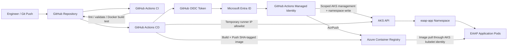

<div align="center">

# Workstream 5: CI/CD Automation
### GitHub Actions, OIDC Federation, Terraform Validation, ACR Publishing, and AKS Deployment

**Contoso Digital Services | Microsoft Azure | GitHub Actions | Terraform | Azure Container Registry | Azure Kubernetes Service**

</div>

---

## Executive Summary

I automated the EAAP application delivery path with GitHub Actions so code changes can be validated, packaged, published, and deployed without storing a long-lived Azure password or service-principal secret in GitHub.

The workstream introduces a dedicated user-assigned managed identity for GitHub Actions, OpenID Connect (OIDC) federation between GitHub and Microsoft Entra ID, scoped Azure RBAC, Terraform validation, Docker image builds, Azure Container Registry publishing, and controlled deployment to the existing AKS `eaap-app` namespace.

> **Outcome:** The platform now has a repeatable CI/CD path from Git commit to AKS deployment while preserving identity-based authentication and the existing AKS API access restrictions.

---

## Project Snapshot

| Category | Details |
|---|---|
| **Platform** | Microsoft Azure + GitHub Actions |
| **Business scenario** | Automated delivery for an enterprise container platform |
| **Primary focus** | CI validation, OIDC authentication, image publishing, controlled AKS deployment |
| **Key services** | GitHub Actions, Microsoft Entra Workload Identity Federation, Azure Container Registry, AKS, Azure RBAC |
| **Engineering tools** | Terraform, GitHub Actions YAML, Docker, Azure CLI, kubectl, kubelogin, Git |
| **Deployment model** | Existing EAAP Terraform state plus source-controlled GitHub workflows |
| **Validation** | Terraform validation, OIDC login, ACR image tag, AKS rollout, running replicas, clean Terraform plan |

---

## Business Context

The container platform is operational, but application delivery still depends on commands run from an engineer workstation. Manual image builds and `kubectl apply` steps are difficult to audit and repeat consistently.

The platform therefore needs a controlled deployment process that can validate infrastructure code, build immutable application images, authenticate to Azure without stored cloud credentials, and deploy only through an approved automation identity.

---

## Engineering Challenge

The design needed to:

- Avoid client secrets and service-principal passwords in GitHub
- Preserve the existing ACR admin-disabled design
- Give the pipeline only the Azure permissions required for deployment
- Limit Kubernetes write access to the `eaap-app` namespace
- Keep Terraform validation separate from Terraform apply
- Build immutable image versions tied to Git commits
- Deploy through the existing AKS cluster without making its API permanently open to the internet
- Restore the AKS API authorized-IP list after each deployment
- Keep sensitive Terraform backend files outside GitHub

---

## Target Architecture



---

## What I Implemented

### Dedicated CI/CD Identity

A separate user-assigned managed identity is created for GitHub Actions rather than reusing the application workload identity or the human engineer identity.

This keeps the trust boundaries clear:

```text
Human engineer identity      -> interactive administration
AKS cluster identity         -> Azure infrastructure operations
AKS kubelet identity         -> ACR image pull
Application workload identity -> Key Vault secret access
GitHub Actions identity      -> automated build and deployment
```

### GitHub-to-Azure OIDC Federation

The GitHub deployment job requests a short-lived OIDC token. Microsoft Entra ID trusts that token only when it matches the configured EAAP GitHub repository and `dev` environment.

No Azure client secret is stored in GitHub.

### Scoped Azure RBAC

The automation identity receives:

- `AcrPush` on the EAAP registry
- AKS cluster-management permission required for the controlled API allowlist update
- AKS cluster-user access for kubeconfig retrieval
- `Azure Kubernetes Service RBAC Writer` scoped to the `eaap-app` namespace

The application workload identity remains the identity used by pods to retrieve Key Vault secrets.

### CI Validation

Pull requests and changes to `main` run checks that include:

- `terraform fmt -check -recursive`
- `terraform init -backend=false`
- `terraform validate`
- Local Docker image build validation

The CI workflow does not require access to the remote Terraform backend and does not run `terraform apply`.

### Immutable Application Image Tags

The deployment pipeline tags images with a shortened Git commit SHA rather than repeatedly overwriting `v1` or `latest`.

Example:

```text
acreaapdev5803.azurecr.io/eaap-sample-web:3f8a71c2d910
```

This creates a direct link between the Git commit and the image deployed to AKS.

### Controlled AKS Deployment

The AKS API remains protected by authorized IP ranges. Because GitHub-hosted runner IPs are temporary, the deployment job:

1. Reads the current AKS API authorized-IP list.
2. Adds only the current runner public IP.
3. Deploys the updated image.
4. Validates the rollout.
5. Restores the original authorized-IP list in an `always()` cleanup step.

This is a development-portfolio compromise. A production platform would normally use a private/self-hosted runner path or another approved private deployment channel instead of changing the public API allowlist per run.

---

## Key Engineering Decisions and Tradeoffs

| Decision | Rationale | Tradeoff |
|---|---|---|
| Use OIDC instead of client secrets | Removes long-lived Azure credentials from GitHub | Requires federated identity configuration |
| Use a dedicated deployment identity | Separates automation permissions from human and application identities | Adds another identity and RBAC lifecycle |
| Keep Terraform apply manual in this phase | Prevents application delivery automation from having broad infrastructure-write access | Infrastructure changes still require engineer review/apply |
| Tag images with Git SHA | Makes releases traceable and rollback-friendly | Produces more image tags that need lifecycle management |
| Scope Kubernetes writer to `eaap-app` | Reduces cluster-wide deployment permissions | Pipeline cannot manage unrelated namespaces |
| Temporarily allowlist runner IP | Preserves restricted AKS API access while using hosted runners | Adds deployment time and requires AKS management permission |
| Restore IP ranges in `always()` cleanup | Prevents temporary access from becoming permanent after a failed job | Cleanup must be monitored if Azure control-plane operations fail |

---

## Implementation Issues Anticipated

### GitHub OIDC subject mismatch

**Issue:** The federated credential subject must exactly match the GitHub token subject.

**Resolution:** Use the `dev` GitHub Environment in the deployment job and configure the Azure federated credential for:

```text
repo:michaeledwards0/enterprise-azure-application-platform:environment:dev
```

### GitHub runner cannot reach AKS

**Issue:** The AKS API server is restricted to approved IP ranges, while GitHub-hosted runners use changing public IPs.

**Resolution:** Temporarily add only the current runner `/32`, deploy, then restore the previous list.

### Azure RBAC propagation delay

**Issue:** Newly created pipeline role assignments can take several minutes before they authorize the first workflow.

**Resolution:** Verify assignments and allow propagation time before diagnosing the workflow as broken.

### ACR login succeeds but push fails

**Issue:** Azure authentication alone does not grant registry data-plane push access.

**Resolution:** Confirm the GitHub Actions managed identity has `AcrPush` at the registry scope.

### Kubernetes authorization returns Forbidden

**Issue:** Cluster credential retrieval and Kubernetes object authorization are separate permission layers.

**Resolution:** Grant cluster-user access plus `Azure Kubernetes Service RBAC Writer` at the `eaap-app` namespace scope.

---

## Results and Validation

| Result | Validation |
|---|---|
| OIDC trust established | GitHub workflow authenticates to Azure without a client secret |
| CI checks active | Terraform format/validate and Docker build checks pass |
| Registry publishing automated | ACR contains the Git SHA image tag |
| AKS API remains restricted | Runner IP is temporary and original allowlist is restored |
| Namespace-scoped deployment works | Pipeline can update `eaap-app` resources without cluster-admin access |
| Release completes | `kubectl rollout status` succeeds |
| Application remains replicated | Two application pods report Ready after deployment |
| Infrastructure remains synchronized | Follow-up Terraform plan reports no changes |

---

## Evidence

| Evidence | What It Proves | Screenshot |
|---|---|---|
| GitHub Actions identity | Dedicated automation identity exists | `../../screenshots/phase-5/01-github-actions-identity.png` |
| Federated credential | GitHub `dev` environment is trusted through OIDC | `../../screenshots/phase-5/02-federated-credential.png` |
| Scoped RBAC | ACR and AKS roles are assigned to the automation identity | `../../screenshots/phase-5/03-cicd-rbac.png` |
| CI workflow | Terraform and Docker validation pass | `../../screenshots/phase-5/04-ci-workflow.png` |
| CD workflow | OIDC login, build, push, and deploy succeed | `../../screenshots/phase-5/05-cd-workflow.png` |
| ACR image | Git SHA image exists in ACR | `../../screenshots/phase-5/06-acr-sha-image.png` |
| AKS rollout | Deployment completes successfully | `../../screenshots/phase-5/07-aks-rollout.png` |
| Running pods | Updated replicas are Ready | `../../screenshots/phase-5/08-running-pods.png` |
| API allowlist restored | Temporary runner IP was removed | `../../screenshots/phase-5/09-api-allowlist-restored.png` |
| Clean plan | Terraform remains synchronized | `../../screenshots/phase-5/10-clean-plan.png` |

---

## Skills Demonstrated

`GitHub Actions` · `CI/CD` · `OIDC` · `Workload Identity Federation` · `Azure RBAC` · `Terraform Validation` · `Docker` · `Azure Container Registry` · `AKS` · `kubectl` · `Release Automation` · `Least Privilege`

---

## Repository Navigation

- **Detailed implementation:** [Workstream 5 Runbook](../../runbooks/phase-5-cicd-automation-runbook.md)
- **Previous workstream:** [Workstream 4 — Container Platform](../phase-4-container-platform/README.md)
- **Next workstream:** Workstream 6 — Observability and Operations
- **Project overview:** [Enterprise Azure Application Platform](../../README.md)

---

<div align="center">

**Workstream 5 complete — EAAP now has an identity-based, traceable application delivery pipeline from GitHub to AKS.**

</div>
