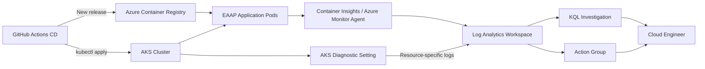

<div align="center">

# Workstream 6: Observability and Operations
### Azure Monitor, Log Analytics, Container Insights, AKS Diagnostics, KQL, and Alerting

**Contoso Digital Services | Microsoft Azure | Azure Monitor | Log Analytics | AKS | KQL | Terraform**

</div>

---

> **Status:** Execution-ready case-study draft. Update the Results/Evidence sections after Workstream 6 is executed.

## Executive Summary

Workstream 6 adds centralized observability to the existing EAAP platform after the successful GitHub-to-AKS deployment pipeline from Workstream 5.

The design adds a dedicated Log Analytics workspace, Container Insights on the existing AKS cluster, AKS resource-specific control-plane diagnostics, an Azure Monitor action group, and practical KQL validation.

The successful Workstream 5 deployment pipeline is reused as a realistic telemetry generator: GitHub Actions authenticates through OIDC, pushes a new application image, updates AKS, and applies Kubernetes release objects while monitoring captures the resulting application and control-plane activity.

> **Target outcome:** EAAP should move from “the app is running” to “the platform can explain what changed, what the cluster observed, and what an engineer should investigate.”

---

## Workstream 5 Dependency

Workstream 6 assumes these Workstream 5 controls are already healthy:

```text
EAAP CI Validation                         PASS
EAAP Deploy to AKS                         PASS
GitHub OIDC → Entra application            PASS
ACR push                                   PASS
AKS authentication                         PASS
app-release.yaml deployment                PASS
Two Ready application pods                 PASS
AKS API allowlist restoration              PASS
```

The application deployment path now updates only:

```text
Deployment
Service
```

The platform baseline remains separately managed:

```text
Namespace
ServiceAccount
SecretProviderClass
Workload Identity / Key Vault integration
```

This separation is important for Workstream 6 because monitoring should observe the running application without changing the platform security baseline.

---

## Project Snapshot

| Category | Details |
|---|---|
| **Platform** | Microsoft Azure |
| **Business scenario** | Centralized monitoring and operational readiness for a CI/CD-managed AKS application |
| **Primary focus** | Container logs, pod inventory, Kubernetes events, control-plane diagnostics, KQL, notification path |
| **Key services** | Azure Monitor, Log Analytics, Container Insights, AKS diagnostic settings, Action Groups |
| **Engineering tools** | Terraform, Azure CLI, KQL, kubectl, PowerShell, Git, GitHub Actions |
| **Deployment model** | Monitoring added to the existing EAAP Terraform state; Workstream 5 CD remains application-only |
| **Diagnostic mode** | Resource-specific Log Analytics tables (`AKSAudit`, `AKSAuditAdmin`, `AKSControlPlane`) |
| **Validation** | ContainerLogV2, KubeEvents, KubePodInventory, AKS control-plane data, action-group test, clean Terraform plan |

---

## Business Context

A successful deployment pipeline is not enough by itself.

Operations still needs durable answers to questions such as:

- Which application version was deployed?
- Did the new pods become Ready?
- Did any pods restart afterward?
- What did the application write to stdout/stderr?
- What Kubernetes API changes were made?
- Did the control plane report warnings?
- Can engineers correlate a GitHub deployment with AKS telemetry?
- Is there a notification path for future alerts?

Workstream 6 adds those day-two operational capabilities.

---

## Target Architecture



---

## What Will Be Implemented

### Dedicated Log Analytics Workspace

A dedicated operations workspace in:

```text
rg-eaap-operations-dev
```

provides the centralized log destination.

### Container Insights

Container Insights is enabled on the existing AKS resource in place.

Expected data includes:

- application stdout/stderr in `ContainerLogV2`
- Kubernetes inventory in `KubePodInventory`
- Kubernetes events in `KubeEvents`
- AKS monitoring views and inventory

### Resource-Specific AKS Diagnostics

The AKS diagnostic setting uses:

```hcl
log_analytics_destination_type = "Dedicated"
```

so control-plane data lands in AKS-specific tables instead of the legacy catch-all `AzureDiagnostics` table.

Primary tables:

```text
AKSAudit
AKSAuditAdmin
AKSControlPlane
```

### CI/CD as a Telemetry Generator

After monitoring is enabled, run a fresh successful `EAAP Deploy to AKS` workflow.

This gives Workstream 6 a real operational event to investigate:

```text
GitHub OIDC login
ACR image publish
AKS API allowlist update
kubectl Deployment update
pod rollout
allowlist restoration
```

Kubernetes API changes from the release can then be correlated with audit/control-plane logs.

### Operational KQL

The validation queries focus on practical troubleshooting:

- recent application logs
- pod inventory and restart counts
- Kubernetes warnings/events
- Kubernetes API audit activity
- AKS control-plane messages

### Alerting Foundation

An Azure Monitor action group establishes the notification path that later metric and scheduled-query alerts can reuse.

---

## Key Engineering Decisions and Tradeoffs

| Decision | Rationale | Tradeoff |
|---|---|---|
| Reuse existing operations RG | Preserves the EAAP landing-zone boundary | Monitoring shares the operations lifecycle |
| Enable Container Insights in place | Adds observability without rebuilding AKS | Adds ingestion cost and agents |
| Use `ContainerLogV2` | Current container-log schema | Older examples may reference legacy tables |
| Use resource-specific AKS logs | Easier queries and better cost control than `AzureDiagnostics` | Queries differ from older tutorials |
| Reuse Phase 5 deployment as test activity | Validates monitoring against a real release path | Generates a controlled AKS change |
| Keep CD application-only | Preserves least privilege and platform baseline separation | Platform monitoring remains Terraform/workstation managed |
| Defer Managed Grafana | Keeps portfolio cost and complexity lower | No dedicated Grafana visualization layer yet |

---

## Validation Plan

| Target | Validation |
|---|---|
| Operations workspace | `law-eaap-ops-dev-scus-001` exists |
| Container Insights | AKS monitoring add-on enabled |
| Application logs | `ContainerLogV2` returns `eaap-app` logs |
| Pod inventory | `KubePodInventory` returns EAAP pods |
| Kubernetes events | `KubeEvents` query executes and returns available events |
| Audit logs | `AKSAuditAdmin` / `AKSAudit` contain Kubernetes API activity |
| Control-plane logs | `AKSControlPlane` contains selected categories |
| Deployment correlation | Fresh Phase 5 deployment produces observable Kubernetes activity |
| Action group | Test notification path succeeds |
| Terraform state | Follow-up plan reports no unexpected changes |

---

## Evidence Plan

| Evidence | What It Proves | Screenshot |
|---|---|---|
| Log Analytics workspace | Central destination exists | `../../screenshots/phase-6/01-log-analytics-workspace.png` |
| AKS monitoring | Container Insights enabled | `../../screenshots/phase-6/02-aks-monitoring.png` |
| Successful Phase 5 release | Monitoring is observing the real CD path | `../../screenshots/phase-6/03-phase5-deployment.png` |
| Container logs | Application logs centralized | `../../screenshots/phase-6/04-containerlogv2-query.png` |
| Pod inventory | EAAP pod state centralized | `../../screenshots/phase-6/05-pod-inventory-query.png` |
| Kubernetes events | Event query works | `../../screenshots/phase-6/06-kubeevents-query.png` |
| AKS audit/control-plane | Resource-specific AKS diagnostics present | `../../screenshots/phase-6/07-aks-diagnostics.png` |
| Action group | Notification path exists | `../../screenshots/phase-6/08-action-group.png` |
| Alert test | Notification path validated | `../../screenshots/phase-6/09-alert-test.png` |
| Clean plan | Monitoring configuration synchronized | `../../screenshots/phase-6/10-clean-plan.png` |

---

## Skills Demonstrated

`Azure Monitor` · `Log Analytics` · `Container Insights` · `AKS Monitoring` · `Diagnostic Settings` · `Resource-Specific Logs` · `KQL` · `ContainerLogV2` · `AKSAudit` · `AKSControlPlane` · `KubeEvents` · `KubePodInventory` · `Terraform` · `GitHub Actions` · `Operational Troubleshooting`

---

## Repository Navigation

- **Detailed implementation:** [Workstream 6 Runbook](../../runbooks/phase-6-observability-operations-runbook.md)
- **Previous workstream:** [Workstream 5 — CI/CD Automation](../phase-5-cicd-automation/README.md)
- **Project overview:** [Enterprise Azure Application Platform](../../README.md)
