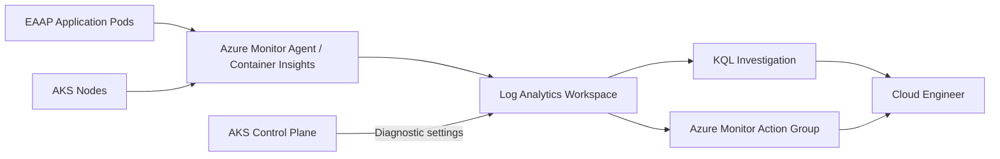

<div align="center">

# Workstream 6: Observability and Operations
### Azure Monitor, Log Analytics, Container Insights, AKS Diagnostics, KQL, and Alerting

**Contoso Digital Services | Microsoft Azure | Azure Monitor | Log Analytics | AKS | KQL | Terraform**

</div>

---

## Executive Summary

I added an operational observability layer to the Enterprise Azure Application Platform so engineers can investigate AKS health, container behavior, Kubernetes events, and Azure control-plane activity from a centralized monitoring workspace.

This workstream introduces a dedicated Log Analytics workspace in the operations resource group, Container Insights for the existing AKS cluster, AKS control-plane diagnostic logs, an Azure Monitor action group, operational KQL queries, and a repeatable validation process for application and platform incidents.

> **Outcome:** EAAP now produces centralized operational telemetry that can be queried, reviewed, and used for incident response instead of relying only on live `kubectl` output from an engineer workstation.

---

## Project Snapshot

| Category | Details |
|---|---|
| **Platform** | Microsoft Azure |
| **Business scenario** | Centralized monitoring and operational readiness for AKS-hosted applications |
| **Primary focus** | Container logs, Kubernetes inventory/events, control-plane logs, KQL investigation, alerting |
| **Key services** | Azure Monitor, Log Analytics, Container Insights, AKS diagnostic settings, Action Groups |
| **Engineering tools** | Terraform, Azure CLI, KQL, kubectl, PowerShell, Git |
| **Deployment model** | Added to the existing EAAP Terraform environment and remote state |
| **Validation** | Workspace ingestion, ContainerLogV2, KubeEvents, KubePodInventory, control-plane logs, alert delivery, clean plan |

---

## Business Context

A running application is not operationally ready if engineers can only determine health by manually running `kubectl get pods`.

The platform needs durable telemetry that survives individual terminal sessions and supports questions such as:

- Which pods restarted?
- What Kubernetes events occurred before a failure?
- Which container produced an error?
- Did an AKS administrative change occur?
- Is the cluster control plane producing warning or audit events?
- Can the operations team query one central location during an incident?

---

## Engineering Challenge

The monitoring design needed to:

- Reuse the existing `rg-eaap-operations-dev` operations boundary
- Enable monitoring without rebuilding the AKS cluster
- Centralize container and Kubernetes inventory data
- Collect AKS control-plane diagnostic logs
- Prefer the current `ContainerLogV2` schema
- Keep monitoring cost visible and bounded for a portfolio environment
- Avoid adding a large always-on visualization platform before it is needed
- Provide useful KQL queries that an engineer can actually use during troubleshooting
- Preserve Terraform state continuity

---

## Target Architecture



---

## What I Implemented

### Dedicated Log Analytics Workspace

A dedicated EAAP operations workspace is placed in:

```text
rg-eaap-operations-dev
```

This keeps operational telemetry separate from application runtime resources and provides a central destination for AKS monitoring data.

### Container Insights

The existing AKS resource is updated in place with the `oms_agent` integration.

Container Insights provides durable operational data such as:

- Container stdout/stderr in `ContainerLogV2`
- Kubernetes events in `KubeEvents`
- Pod inventory in `KubePodInventory`
- Node and workload inventory used by Azure Monitor views

### AKS Control-Plane Diagnostic Logs

Azure diagnostic settings send available AKS control-plane categories to the same Log Analytics workspace.

The configuration discovers the categories exposed by the deployed cluster and enables the key categories available in the environment, including API server, audit, controller-manager, scheduler, and autoscaler telemetry where supported.

### Operational KQL

The workstream validates a small set of practical queries rather than creating dashboards with no troubleshooting purpose.

Examples include:

- Recent application container logs
- Warning Kubernetes events
- Pod restart inventory
- AKS control-plane warnings and audit activity

### Alerting Foundation

An Azure Monitor action group creates the notification destination for future metric and log alerts.

This establishes the response channel without turning the portfolio environment into a high-volume monitoring bill.

---

## Key Engineering Decisions and Tradeoffs

| Decision | Rationale | Tradeoff |
|---|---|---|
| Use dedicated EAAP Log Analytics workspace | Keeps project operations data organized and queryable | Creates ingestion and retention cost |
| Enable Container Insights on existing AKS | Adds container/Kubernetes telemetry without rebuilding the cluster | Adds monitoring agents and data collection |
| Use `ContainerLogV2` | Aligns with current Azure Monitor container logging | Query syntax differs from legacy `ContainerLog` examples |
| Send control-plane diagnostics to same workspace | Gives one investigation location | High-volume audit categories can increase ingestion |
| Start with focused KQL and an action group | Proves operational readiness without unnecessary tooling | Full dashboards and advanced alerts remain later enhancements |
| Defer Managed Grafana | Controls cost and complexity for the portfolio environment | No dedicated Grafana visualization layer in this phase |

---

## Implementation Issues Anticipated

### Monitoring resource providers are not registered

**Issue:** A new subscription can return `MissingSubscriptionRegistration` when Azure Monitor resources are first deployed.

**Resolution:** Register the required providers before applying monitoring resources.

### AKS update shows unexpected replacement

**Issue:** Adding monitoring to an existing Terraform-managed AKS resource must be an in-place change.

**Resolution:** Stop if the Terraform plan proposes destroying/recreating the cluster. Reconcile the existing `azurerm_kubernetes_cluster` configuration before applying.

### No logs immediately after enablement

**Issue:** Monitoring data does not appear instantly after enabling Container Insights.

**Resolution:** Keep the cluster running, generate application activity, wait for ingestion, then query the expected tables.

### KQL examples use the wrong table

**Issue:** Older examples may reference `ContainerLog` while the platform uses `ContainerLogV2`.

**Resolution:** Validate the schema in the workspace and use `ContainerLogV2` queries for the current configuration.

---

## Results and Validation

| Result | Validation |
|---|---|
| Operations workspace deployed | Dedicated Log Analytics workspace exists in `rg-eaap-operations-dev` |
| Container Insights enabled | AKS reports monitoring integration and data arrives in the workspace |
| Container logs centralized | `ContainerLogV2` returns EAAP application records |
| Kubernetes events available | `KubeEvents` returns cluster events |
| Pod inventory available | `KubePodInventory` returns `eaap-app` pods |
| Control-plane logs collected | AKS diagnostic categories arrive in Azure Monitor tables |
| Alert channel created | Action group exists and test notification succeeds |
| Platform synchronized | Follow-up Terraform plan reports no changes |

---

## Evidence

| Evidence | What It Proves | Screenshot |
|---|---|---|
| Log Analytics workspace | Central monitoring destination exists | `../../screenshots/phase-6/01-log-analytics-workspace.png` |
| AKS monitoring | Container Insights is enabled | `../../screenshots/phase-6/02-aks-monitoring.png` |
| Container logs | `ContainerLogV2` contains EAAP workload logs | `../../screenshots/phase-6/03-containerlogv2-query.png` |
| Kubernetes events | Warning/events query returns data | `../../screenshots/phase-6/04-kubeevents-query.png` |
| Pod inventory | `eaap-app` pod inventory is centralized | `../../screenshots/phase-6/05-pod-inventory-query.png` |
| Diagnostic settings | AKS control-plane logs target the workspace | `../../screenshots/phase-6/06-aks-diagnostics.png` |
| Action group | Operational notification path exists | `../../screenshots/phase-6/07-action-group.png` |
| Alert test | Notification path was validated | `../../screenshots/phase-6/08-alert-test.png` |
| Clean plan | Monitoring configuration is synchronized | `../../screenshots/phase-6/09-clean-plan.png` |

---

## Skills Demonstrated

`Azure Monitor` · `Log Analytics` · `Container Insights` · `AKS Monitoring` · `Diagnostic Settings` · `KQL` · `ContainerLogV2` · `KubeEvents` · `Operational Troubleshooting` · `Terraform` · `Alerting`

---

## Repository Navigation

- **Detailed implementation:** [Workstream 6 Runbook](../../runbooks/phase-6-observability-operations-runbook.md)
- **Previous workstream:** [Workstream 5 — CI/CD Automation](../phase-5-cicd-automation/README.md)
- **Next workstream:** Application delivery, data services, Layer 7 ingress/WAF, and resilience can build on this monitored platform
- **Project overview:** [Enterprise Azure Application Platform](../../README.md)

---

<div align="center">

**Workstream 6 complete — EAAP now has centralized container, Kubernetes, and control-plane visibility for day-two operations.**

</div>
