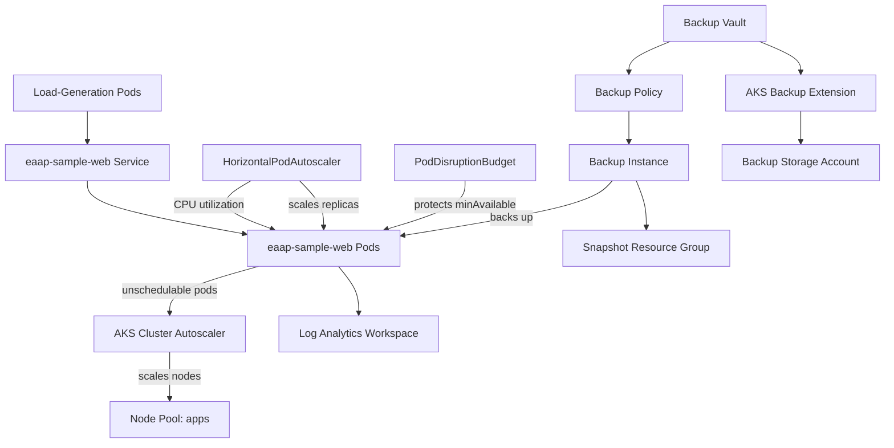

<div align="center">

# Workstream 7: Reliability and Recovery
### Autoscaling, Pod Disruption Budgets, Azure Backup for AKS, and Failure-Injection Testing

**Contoso Digital Services | Microsoft Azure | AKS | Azure Backup | Kubernetes | Terraform**

</div>

---

> **Status:** Execution-ready case-study draft. Update the Results/Evidence sections after Workstream 7 is executed.

## Executive Summary

Workstream 7 moves the EAAP platform from "the application is deployed and observable" to "the application can absorb load, tolerate node loss, and recover from configuration loss."

The design adds resource requests/limits and a Horizontal Pod Autoscaler to the sample application, a Pod Disruption Budget to protect availability during voluntary disruptions, a load-generation exercise to validate both pod-level and node-level autoscaling, a `kubectl drain` failure-injection test to prove the PDB actually holds, and Azure Backup for AKS to back up and restore the `eaap-app` namespace's Kubernetes objects.

> **Target outcome:** EAAP should be able to answer "what happens if a node dies right now, and what happens if someone deletes the namespace by accident" with evidence, not assumptions.

---

## Workstream 6 Dependency

Workstream 7 assumes the Workstream 6 observability stack is healthy and is used throughout this phase to *observe* the reliability tests rather than just to run them blind:

```text
Log Analytics workspace                     law-eaap-ops-dev-scus-001
Container Insights + DCR association         Confirmed and ingesting
ContainerLogV2 / KubePodInventory            Returning data
Action group                                 ag-eaap-platform-dev-scus-001
```

Every failure-injection test in this workstream is paired with a KQL query against the Workstream 6 workspace so the result is evidence, not a screenshot of a terminal that scrolled by.

---

## Project Snapshot

| Category | Details |
|---|---|
| **Platform** | Microsoft Azure |
| **Business scenario** | Prove the AKS application platform tolerates load spikes, node failure, and accidental configuration loss |
| **Primary focus** | Horizontal Pod Autoscaling, Pod Disruption Budgets, cluster autoscaler validation, Azure Backup for AKS, restore validation |
| **Key services** | AKS, Azure Monitor / Log Analytics (from Workstream 6), Azure Backup (Data Protection), Azure Storage |
| **Engineering tools** | Terraform, Azure CLI, kubectl, PowerShell, KQL, Git, GitHub Actions |
| **Deployment model** | Reliability config added to `app-release.yaml`; backup infrastructure added to the existing EAAP Terraform state |
| **Recovery scope** | Kubernetes object-level backup and restore for the `eaap-app` namespace (the sample workload is stateless — no persistent volumes exist yet) |
| **Validation** | HPA scale-out under load, cluster autoscaler node scale-out, PDB-protected node drain, backup completion, namespace restore |

---

## Business Context

Everything through Workstream 6 proves the platform deploys, secures, and observes a working application. It does not yet prove the platform survives anything going wrong.

A platform engineer should be able to answer, with evidence:

- If traffic spikes, does the application scale out automatically, and does the cluster have room to schedule the new pods?
- If a node fails or is drained for maintenance, does the application stay available the whole time?
- If someone deletes the application namespace by mistake, can it be brought back, and how long does that take?
- What are the platform's actual RTO/RPO targets, and were they met during a real test?

Workstream 7 answers those questions directly instead of asserting them.

---

## Engineering Challenge

- The sample application currently has no CPU/memory requests or limits, which makes CPU-based autoscaling meaningless and lets a single pod consume unbounded node resources.
- Node pools already have the cluster autoscaler enabled (`min_count = 1`, `max_count = 2` on both pools since Workstream 4), but that behavior has never actually been exercised or proven.
- Nothing currently stops a node drain or cluster autoscaler scale-down from taking the application to zero available replicas at the same moment.
- The sample application is stateless, so "backup and restore" has to mean something honest for this workload: recovering the Kubernetes object definitions and configuration, not application data that doesn't exist yet.
- Azure Backup for AKS is a comparatively new capability with several moving pieces (backup vault, cluster extension, trusted access role binding, snapshot resource group, several scoped role assignments) that all have to agree with each other before a backup instance will actually complete successfully.
- Recovery testing has to be safe to run in a shared-subscription lab environment without touching the sibling Azure AI Infrastructure project's resources.

---

## Target Architecture



---

## What I Implemented

### Resource Requests, Limits, and a Meaningful HPA Target

The sample application deployment had no CPU/memory requests or limits. Requests of `100m`/`128Mi` and limits of `250m`/`256Mi` were added so that CPU-based autoscaling has an actual denominator to calculate utilization against, and so a single runaway pod cannot starve its node neighbors.

A `HorizontalPodAutoscaler` (`autoscaling/v2`) targets `eaap-sample-web`, scaling between 2 and 6 replicas on 70% average CPU utilization.

### Pod Disruption Budget

A `PodDisruptionBudget` with `minAvailable: 1` protects the application during voluntary disruptions — node drains, cluster autoscaler scale-down, and future cluster upgrades — so Kubernetes will not evict every replica at once even if the HPA has scaled down to a low replica count.

### Load-Generation and Cluster Autoscaler Validation

A temporary in-cluster load generator drives sustained concurrent requests against the internal `eaap-sample-web` service, pushing CPU utilization past the HPA's 70% threshold. This validates two layers at once: the HPA adding pod replicas, and — because the `apps` node pool is capped at `max_count = 2` — the cluster autoscaler adding a node if the existing capacity cannot schedule the new replicas.

### Failure Injection: Node Drain Under Load

With the PDB in place, one node is cordoned and drained mid-test. The validation is not "the node drained successfully" — it is "the service never stopped responding while it did," confirmed by continuous polling against the internal load balancer IP and cross-referenced against `KubePodInventory` and `KubeEvents` in the Workstream 6 workspace.

### Azure Backup for AKS

A dedicated Backup Vault, a Kubernetes cluster backup extension, a weekly backup policy, and a backup instance scoped to the `eaap-app` namespace were deployed. The AKS cluster is granted Trusted Access to the vault so backup operations do not require broad standing credentials, and the extension's storage account is scoped only to backup artifacts.

### Restore Validation

The `eaap-app` namespace's Deployment and Service are deliberately deleted, then restored from the most recent backup, with the restore timed against a defined RTO target and the application's return to `2/2 Ready` confirmed through both `kubectl` and the Workstream 6 KQL queries.

---

## Key Engineering Decisions and Tradeoffs

| Decision | Rationale | Tradeoff |
|---|---|---|
| Add resource requests/limits before adding the HPA | CPU-based autoscaling is meaningless without a request to calculate utilization against | Under-sized limits could throttle the app under legitimate load; values should be revisited with real traffic data |
| Use `autoscaling/v2` HPA on CPU utilization | Simplest, most portable autoscaling signal; no extra infrastructure required | Does not react to request latency or queue depth — a KEDA/custom-metrics approach would be more precise but adds complexity |
| Cap node pool `max_count` at 2 | Keeps the reliability test's cost and blast radius small and predictable | Scale-out ceiling is a lab constraint, not a production-representative number |
| Scope the Azure Backup instance to the `eaap-app` namespace only | Matches the platform's existing least-privilege, project-scoped pattern in a shared subscription | Cluster-scoped resources (ClusterRoles, CRDs) are not covered by this backup |
| Treat this as Kubernetes-object backup, not data backup | The sample workload is stateless — there is no persistent volume to protect yet | The story is intentionally honest about scope rather than implying full disaster recovery for stateful data that doesn't exist |
| Use a dedicated resource group for backup snapshots | Keeps snapshot lifecycle and RBAC separate from the running platform resource groups | Adds one more resource group boundary to reason about |
| Run the failure-injection test live against the running application | Proves the PDB and autoscaler actually work, not just that they're declared | Briefly reduces available capacity during the drain; scheduled for a low-traffic window |

---

## Validation Plan

| Target | Validation |
|---|---|
| Resource requests/limits | `kubectl describe deployment eaap-sample-web` shows non-empty requests and limits |
| HPA | `kubectl get hpa -n eaap-app` shows `TARGETS` climbing toward/past 70% under load and `REPLICAS` increasing |
| Cluster autoscaler | Node count in `kubectl get nodes` increases when the `apps` pool cannot schedule new replicas at 2 nodes |
| PDB | `kubectl get pdb -n eaap-app` shows the expected `MIN AVAILABLE`/`ALLOWED DISRUPTIONS` |
| Node drain | Continuous polling against the service shows no failed requests during `kubectl drain` |
| Backup vault + extension | `az dataprotection backup-vault show` and `az k8s-extension show` report `Succeeded`/`Installed` |
| Backup instance | `az dataprotection backup-instance show` reports a completed backup job |
| Restore | Deleted namespace objects are recreated and pods return to `2/2 Ready` within the defined RTO |
| Observability correlation | KQL queries against the Workstream 6 workspace show the scale, drain, and restore events |
| Terraform state | Follow-up plan reports no unexpected changes |

---

## Evidence Plan

| Evidence | What It Proves | Screenshot |
|---|---|---|
| HPA scale-out | Pod Ready count increases under load | `../../screenshots/phase-7/01-hpa-scale-out.png` |
| Cluster autoscaler | Node count increases under load | `../../screenshots/phase-7/02-cluster-autoscaler.png` |
| PDB definition | Disruption budget is active before the drain test | `../../screenshots/phase-7/03-pdb.png` |
| Node drain in progress | Service continues responding during drain | `../../screenshots/phase-7/04-node-drain.png` |
| Backup vault and extension | Backup infrastructure deployed successfully | `../../screenshots/phase-7/05-backup-vault.png` |
| Completed backup job | A real backup instance completed, not just configured | `../../screenshots/phase-7/06-backup-job.png` |
| Deleted namespace objects | Proof the restore test was a real recovery, not a no-op | `../../screenshots/phase-7/07-deleted-objects.png` |
| Restored application | Pods return to Ready after restore | `../../screenshots/phase-7/08-restore-complete.png` |
| KQL correlation | Log Analytics observed the reliability events | `../../screenshots/phase-7/09-kql-correlation.png` |
| Clean plan | Reliability and backup configuration synchronized | `../../screenshots/phase-7/10-clean-plan.png` |

---

## Skills Demonstrated

`Kubernetes Autoscaling` · `HorizontalPodAutoscaler` · `Pod Disruption Budgets` · `AKS Cluster Autoscaler` · `Azure Backup for AKS` · `Data Protection Backup Vaults` · `Trusted Access` · `Failure Injection Testing` · `RTO/RPO Validation` · `KQL Correlation` · `Terraform` · `kubectl`

---

## Repository Navigation

- **Detailed implementation:** [Workstream 7 Runbook](../../runbooks/phase-7-reliability-recovery-runbook.md)
- **Previous workstream:** [Workstream 6 — Observability and Operations](phase-6-observability-operations-case-study.md)
- **Next workstream:** Workstream 8 — Platform Security
- **Project overview:** [Enterprise Azure Application Platform](../../README.md)
