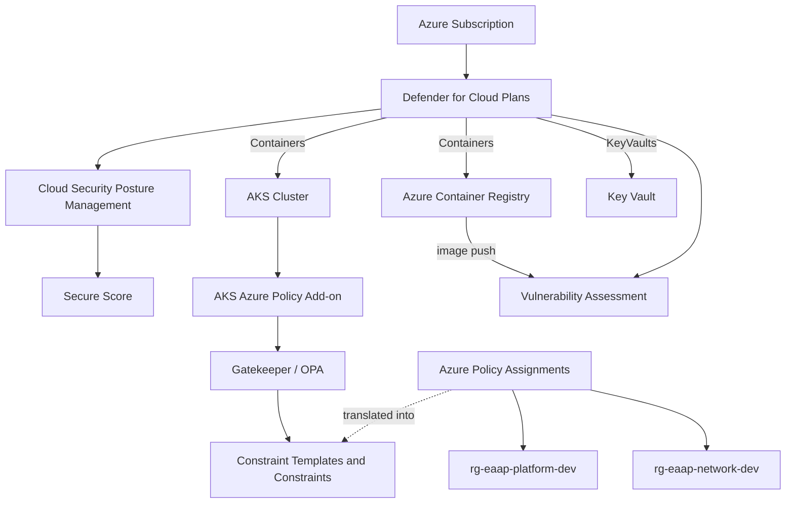

# Workstream 8: Platform Security
### Microsoft Defender for Cloud, Azure Policy Governance, and AKS Admission Control

**Contoso Digital Services | Microsoft Azure | Defender for Cloud | Azure Policy | AKS | Terraform**

---

> **Status:** Execution-ready case-study draft. Update the Results/Evidence sections after Workstream 8 is executed.

## Executive Summary

Workstream 8 shifts EAAP from "the platform is privately networked and identity-controlled" to "the platform actively detects misconfiguration and vulnerable images, and enforces a security baseline at admission time."

The design enables Microsoft Defender for Cloud plans for Containers, Key Vault, and Cloud Security Posture Management; enables the AKS Azure Policy add-on for in-cluster Gatekeeper-based admission control; and assigns a small set of built-in Azure Policy definitions scoped to the EAAP resource groups in `Audit` mode.

> **Target outcome:** EAAP should be able to show a Secure Score, a real vulnerability finding on a container image, and a policy compliance state — not just describe security controls in prose.

---

## Shared-Subscription Consideration

Both EAAP and the sibling Enterprise Azure AI Infrastructure project share one Azure subscription (see the project root README's **Tenant and Subscription Strategy**). Microsoft Defender for Cloud pricing plans are a subscription-wide setting — they cannot be scoped to a single resource group. Enabling Defender for Containers, Key Vault, and Cloud Security Posture Management in this workstream therefore benefits and applies to both portfolio projects simultaneously, which is a deliberate and disclosed tradeoff rather than an oversight.

Azure Policy assignments, by contrast, are scoped to the EAAP resource groups specifically in this workstream, so policy governance does not reach into the sibling project's resources. This mirrors the same resource-group-boundary pattern used throughout the platform since Workstream 1.

---

## Project Snapshot

| Category | Details |
|---|---|
| **Platform** | Microsoft Azure |
| **Business scenario** | Continuous security posture visibility and enforced baseline controls for the AKS application platform |
| **Primary focus** | Defender for Cloud plans, Azure Policy governance, AKS Azure Policy add-on (Gatekeeper) |
| **Key services** | Microsoft Defender for Cloud, Azure Policy, AKS, Azure Container Registry |
| **Engineering tools** | Terraform, Azure CLI, kubectl, PowerShell, Git |
| **Deployment model** | Security controls added to the existing EAAP Terraform state |
| **Policy effect** | `Audit` — findings are visible without silently breaking the existing dev-lab configuration |
| **Validation** | Defender plan status, Secure Score movement, ACR vulnerability finding, Gatekeeper constraint enforcement, policy compliance state |

---

## Business Context

Earlier workstreams built strong preventative controls: private networking, managed identity, least-privilege RBAC, Key Vault, and a secretless CI/CD pipeline. None of that tells an engineer whether a newly pushed container image has a known CVE, whether a future Terraform change accidentally reintroduces a privileged container, or how the platform's overall posture compares to Microsoft's own recommendations.

Workstream 8 adds the detective and enforcing layer on top of the preventative controls already in place.

---

## Engineering Challenge

- Defender for Cloud plans are subscription-scoped, which conflicts with the platform's otherwise strict resource-group boundary discipline in a shared subscription — this has to be acknowledged, not hidden.
- The existing ACR (`acreaapdev5803`) was deliberately deployed in Workstream 4 with `public_network_access_enabled = true` for lab reachability, which several built-in "container registry network" policies would flag or outright deny if assigned too aggressively.
- Assigning policies in `Deny` mode against a running lab environment risks blocking normal Terraform operations for reasons unrelated to the security control being tested.
- The AKS Azure Policy add-on and Gatekeeper need to be validated as actually enforcing something, not just reported as "enabled" in the cluster configuration.
- Findings need to be real, not simulated — a vulnerability scan result on an actual pushed image, not a hypothetical description of what Defender would find.

---

## Target Architecture

---

## What Will Be Implemented

### Defender for Cloud Plans

Three Defender plans are enabled at `Standard` tier: `Containers` (covers both AKS and ACR image scanning), `KeyVaults`, and `CloudPosture` (Defender CSPM, which drives the Secure Score and attack-path analysis).

### AKS Azure Policy Add-on

`azure_policy_enabled = true` is added to the existing `azurerm_kubernetes_cluster` resource — an in-place update, consistent with how Container Insights was added in Workstream 6. This deploys the Gatekeeper-based admission controller that translates assigned Azure Policy definitions into in-cluster constraints.

### Scoped Policy Assignments

A small, deliberately chosen set of built-in policy definitions are assigned at the EAAP resource-group scope in `Audit` mode:

- Kubernetes clusters should not allow privileged containers
- Kubernetes cluster containers should not share host process ID or host IPC namespace
- Kubernetes cluster containers should only use allowed images (scoped to the EAAP ACR login server)
- Container registries should not allow unrestricted network access

The last policy is assigned in `Audit` mode deliberately — the existing ACR was intentionally deployed with public network access enabled in Workstream 4 for lab reachability from a workstation without private connectivity. Assigning this policy in `Deny` mode would conflict with an existing, documented design decision rather than surface a new finding. Auditing it keeps the gap visible without silently breaking the lab.

### Vulnerability Assessment Validation

After Defender for Containers is enabled, the Workstream 5 CI/CD pipeline is used to push a fresh image, and the resulting Defender vulnerability findings on that image are reviewed as real evidence rather than a described capability.

---

## Key Engineering Decisions and Tradeoffs

| Decision | Rationale | Tradeoff |
|---|---|---|
| Enable Defender plans at subscription scope | Defender for Cloud plans cannot be scoped below subscription level | Benefits and costs both apply to the sibling AI project as well |
| Scope Azure Policy assignments to EAAP resource groups only | Preserves the resource-group boundary discipline used since Workstream 1 | Policy coverage is intentionally partial rather than subscription-wide |
| Assign policies in `Audit` mode, not `Deny` | Surfaces findings without breaking a lab environment that already has documented, deliberate exceptions (e.g. public ACR access) | Findings require a human decision to remediate; nothing is auto-blocked |
| Enable the AKS Azure Policy add-on | Gives the cluster real, enforceable admission control via Gatekeeper, not just reporting | Adds Gatekeeper pods and constraint evaluation overhead to the cluster |
| Validate with a real ACR vulnerability finding | Proves the Defender for Containers plan is actually scanning images, not just enabled | Requires waiting for scan completion after an image push, which is not instantaneous |
| Defer `Deny`-mode enforcement to a later hardening pass | Keeps this workstream focused on establishing visibility first | The platform is not yet blocking noncompliant deployments automatically |

---

## Validation Plan

| Target | Validation |
|---|---|
| Defender plans | `az security pricing list` shows `Standard` for Containers, KeyVaults, CloudPosture |
| AKS Policy add-on | `azure_policy_enabled` reports `true`; Gatekeeper pods are Running |
| Constraint templates | `kubectl get constrainttemplates` shows AKS-managed templates |
| Constraints | `kubectl get constraints` shows the assigned policies translated into cluster constraints |
| Policy compliance | `az policy state list` shows compliance evaluation results for the EAAP resource groups |
| ACR vulnerability finding | A pushed image shows at least one Defender vulnerability assessment result |
| Secure Score | Subscription Secure Score reflects the newly enabled plans and controls |
| Terraform state | Follow-up plan reports no unexpected changes |

---

## Evidence Plan

| Evidence | What It Proves | Screenshot |
|---|---|---|
| Defender plans enabled | Containers, Key Vault, and CSPM plans active | `../../screenshots/phase-8/01-defender-plans.png` |
| Secure Score | Posture improvement is measurable | `../../screenshots/phase-8/02-secure-score.png` |
| AKS Policy add-on | Add-on enabled in cluster configuration | `../../screenshots/phase-8/03-aks-policy-addon.png` |
| Gatekeeper constraints | Policies translated into enforceable cluster constraints | `../../screenshots/phase-8/04-gatekeeper-constraints.png` |
| Policy compliance state | Assigned policies evaluated against real resources | `../../screenshots/phase-8/05-policy-compliance.png` |
| ACR vulnerability finding | Real scan result on a pushed image | `../../screenshots/phase-8/06-acr-vulnerability.png` |
| Clean plan | Security configuration synchronized | `../../screenshots/phase-8/07-clean-plan.png` |

---

## Skills Demonstrated

`Microsoft Defender for Cloud` · `Cloud Security Posture Management` · `Azure Policy` · `Built-In Policy Assignment` · `AKS Azure Policy Add-on` · `Gatekeeper / OPA` · `Container Image Vulnerability Assessment` · `Terraform` · `Shared-Subscription Governance` · `Least-Privilege Enforcement Design`

---

## Repository Navigation

- **Detailed implementation:** [Workstream 8 Runbook](../../runbooks/phase-8-platform-security-runbook.md)
- **Previous workstream:** [Workstream 7 — Reliability and Recovery](phase-7-reliability-recovery-case-study.md)
- **Next workstream:** Workstream 9 — Operations and Handoff
- **Project overview:** [Enterprise Azure Application Platform](../../README.md)
